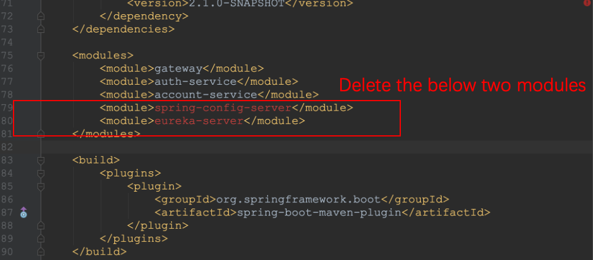
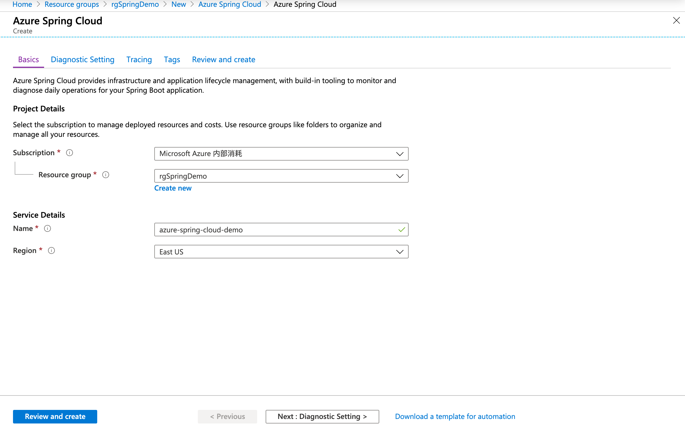
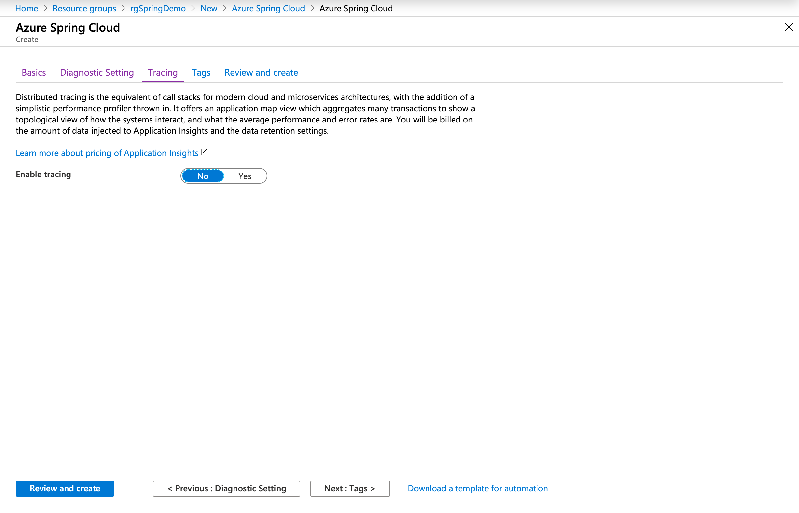
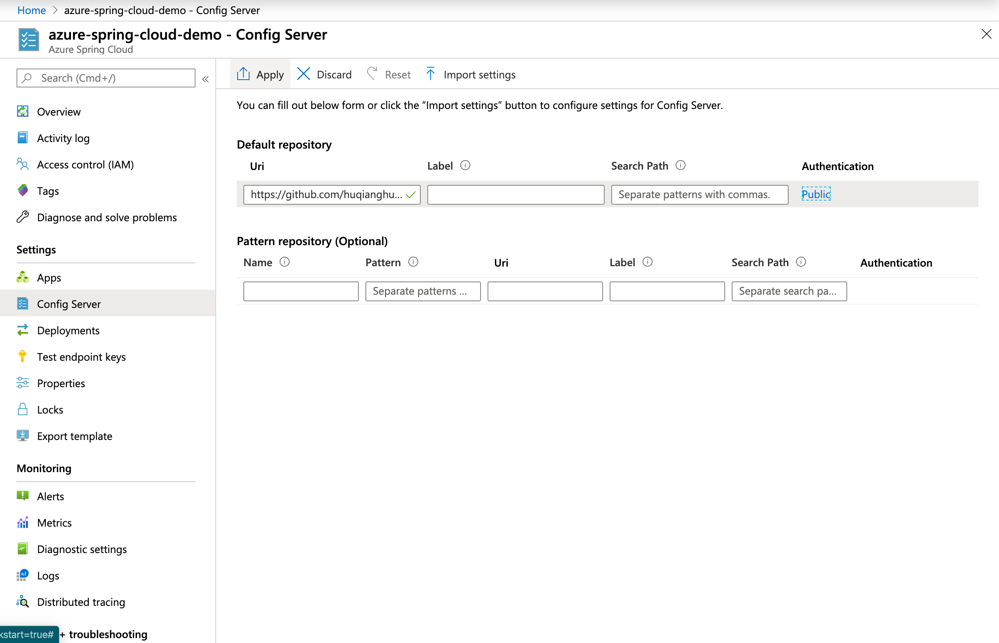
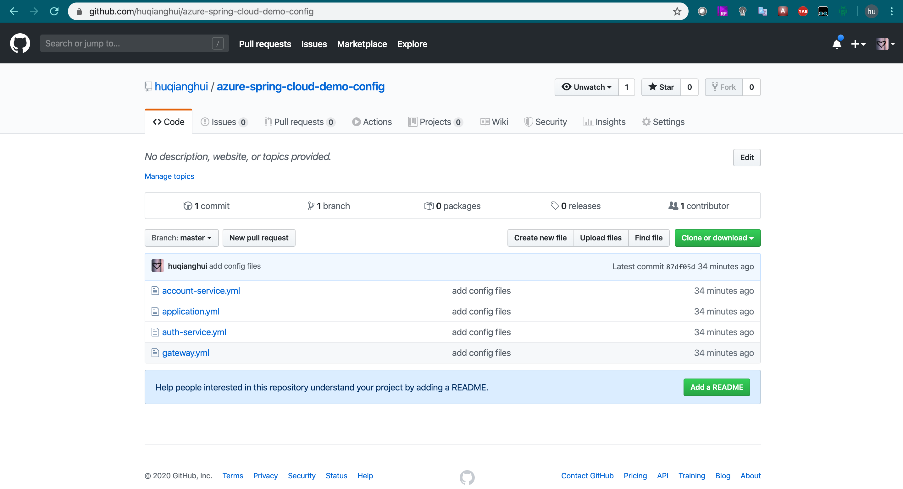
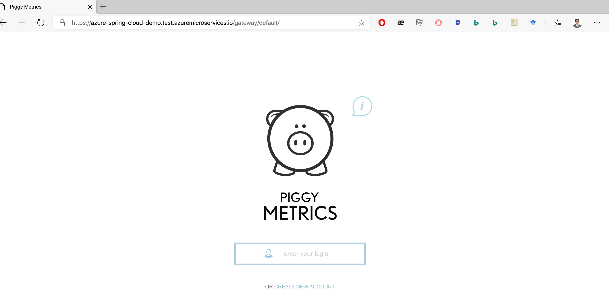

# Lab environment

You can complete this lab use your own environment. Please make sure your have an Azure subscription to complete the exercise #3.

## If you plan to use your own environment, please make sure you have setup below requirement:

- Visual Studio Code
- JDK 8 (https://repos.azul.com/azure-only/zulu/packages/zulu-8/8u232/zulu-8-azure-jdk_8.42.0.23-8.0.232-win_x64.msi)
- Maven 3.3+ (https://www-eu.apache.org/dist/maven/maven-3/3.6.3/binaries/apache-maven-3.6.3-bin.zip)
- Azure CLI 2.0.77 (https://aka.ms/installazurecliwindows)
- Optional: Git

## You can also use the LODS VM as the lab environment.

Basiclly, the LODS provide you a virtual machince which has been pre-configured with development environment. And if you do not have your own Azure subscription, the LODS also provide a free Azure subscription for _one-time_ use, which will be expired after 8 hours or you finish your lab.

- LODS link: https://labondemand.com/LabProfile/62620
- Once you launch the LODS, you may find the Azure account under the left resource tab.

1. Login with your Microsoft AAD account
   
2. Launch LODS VM environment
   
3. Once your VM is ready, you may find the VM login account and a free Azure account under resource tab.
   

- Notice: You cannot copy any text from outside into the VM directly. But you can click the T buttun left to the text to input into the VM.

===

# Exercise #1 Run the SpringMVC app

## Task1 Check development environment by using PowerShell command.

Press Win+R to open the command run widows, and input **Powershell** to open the terminal windows.

- Notice: If you are using the LODS VM, you can use the top-left **Flash** button to send the Win+R command.
  

Input the follwing command to check your environment's ready status.

```Powershell
javac -version
```

```Powershell
mvn -version
```

If everything works well, you should see the result similar to this:


- Notice: If you cannot use the _mvn_ command, following this link to install Maven and config the system environment variable path: https://maven.apache.org/install.html

## Task2 Download the sample code and open it by using Visual Studio Code

## Task3 Build and run the application, open browser to testify the webpage

In this exercise, we will use the code in the **springmvc-monolithic-application** fold.

```Powershell
cd .\springmvc-monolithic-application
```

Under this fold, we use Maven command to build the application.

```Powershell
mvn clean install
```

If you see the **BUILD SUCCESS** means you have built the code successfully.


After build process, the compiled files will be in the **target** fold. So before we run the application, we need to change the path to the target fold.

```Powershell
cd .\target
```

Then, we use the *java -jar*command to run this SpringMVC application.

```Powershell
java -jar .\springmvc-monolithic-application-1.0-SNAPSHOT.jar
```

When you see below output, means your applicaiton has launched successfully.


You may notice the applicaiton's port is _10000_. So open your browers, and open http://localhost:10000 to testify your applicaiton.


Now, just create a new account to try this applicaiton and analysis its functions.

- If you are joining an on-site Lab, please raise your hand so that we know you have complete the Exercise #1. Congrats!

- Notice：You may wonder, we did not install any application server like Tomcat in this lab. So how could the application running successfully? In fact, we use SpringBoot to initialize this SpringMVC application. SpringBoot have pre-configured embeded Tomcat, so when you launch the application, it will start a embeded Tomcat server and deploy your application.

===

# Exercise #2 Remode the SpringMVC app to SpringCloud

从现在工程来展示这个业务可以分成三部分：

- 1.前端页面，负责展示部分
- 2.账户信息管理
- 3.非功能性，用户登陆与注册，认证等。


- 如图是在一个真实的逻辑场景架构图：


在这个实际例子里面，我们主要做到如下两步：

1） 做到前后端分离，把静态资源剥离出来，单独存放与发布

2） 把用户认证这个非功能性功能单独剥离出来，实现 SSO 等。

3） 剩下的用户和账户信息的管理维护作为一个服务。

如下图实现一个最简单，基于 spring cloud 的微服务体系。


按照这个架构图，需要三个功能：
1） API gateway，当做资源服务器，同时也是姿态资源服务，作为整个服务的入口。
2） 认证服务，提供 token 的颁发和认证。
3） 用户和账户的管理，功能性服务。

这里提供了三个模板工程，看怎么一步步实现拆分。

## Task1 Replace the original code by using exercise #2 sample code.

### 打开 Ex2 的脚手架文件作为初始框架，以后可以从 Spring.io 生成脚手架工程。

## Task2 配置 Parent Pom.xml 增加 function model

### 1. 由于功能模块变多，使用同一的 parent 来指定 maven 依赖版本和共同依赖组件。

功能如下：

Notice：这里的 annotation 是 SpringCloud，不是 SpringBoot 了

### 2. parent pom

属性执行和版本规定：

```xml
<properties>
    <project.build.sourceEncoding>UTF-8</project.build.sourceEncoding>
    <spring-cloud.version>Greenwich.SR3</spring-cloud.version>
    <java.version>1.8</java.version>
</properties>

<dependencyManagement>
<dependencies>
    <dependency>
        <groupId>org.springframework.cloud</groupId>
        <artifactId>spring-cloud-dependencies</artifactId>
        <version>${spring-cloud.version}</version>
        <type>pom</type>
        <scope>import</scope>
    </dependency>
</dependencies>
</dependencyManagement>
```

### 3. 公共依赖：

```xml
<dependencies>
    <dependency>
        <groupId>org.springframework.boot</groupId>
        <artifactId>spring-boot-starter-web</artifactId>
    </dependency>
    <dependency>
        <groupId>org.springframework.cloud</groupId>
        <artifactId>spring-cloud-starter</artifactId>
    </dependency>
    <dependency>
        <groupId>org.springframework.boot</groupId>
        <artifactId>spring-boot-starter-actuator</artifactId>
    </dependency>
    <dependency>
        <groupId>org.springframework.cloud</groupId>
        <artifactId>spring-cloud-starter-netflix-hystrix</artifactId>
    </dependency>
    <dependency>
        <groupId>org.springframework.boot</groupId>
        <artifactId>spring-boot-starter-test</artifactId>
        <scope>test</scope>
    </dependency>
</dependencies>
```

### 4. 定义功能模块

```xml
<modules>
    <module>gateway</module>
    <module>auth-service</module>
    <module>account-service</module>
    <module>spring-config-server</module>
    <module>eureka-server</module>
</modules>
```

## Task3 增加共同配置，增加 application.yml

```Powershell
cd .\spring-config-server\resources\
```

```yml
logging:
  level:
    org.springframework.security: INFO

hystrix:
  command:
    default:
      execution:
        isolation:
          thread:
            timeoutInMilliseconds: 300000

feign:
  hystrix:
    enabled: true

eureka:
  instance:
    prefer-ip-address: true
  client:
    serviceUrl:
      defaultZone: http://localhost:8761/eureka/

management: #actuator
  endpoints:
    enable: true
    web:
      exposure:
        include: "*"
```

- 非功能模块介绍

1. 因为是微服务，如果要跑起来最少需要一个服务注册发现。所以在进行拆分之前我们先引入 eureka。
   **请参照 eureka 的说明**

2. 为了集中配置，我们也使用了 springconfig
   **请参照 Spring cloud server 的说明**

3. 为了提供统一的认证和服务流量转发，我们使用 spring cloud zuul 作为网关
   **请参照 spring cloud zuul 说明**

4. 在拆分之前，我们也要稍微了解一下 spring security 相关知识
   **请参照 spring security 说明**

## Task4 拆分 Account-Service：

用 account-service 作为例子，业务比较简单就是用户注册登陆以及转户数据的记录与统计展示。

- 注册用户
  
- 创建账户信息
  
- 登出与登录
  

在这个例子里面，为了简单和减少依赖性，使用的 mongoDB 的内存数据库。包括配置和 token 等，都使用内存存储。

### 1. 删除 config 文件夹

用户和账户服务的把 config 配置信息和 security 信息去掉，其余的全部拷贝到目录下面去掉。
但是需要修改所有的 namespace。最后结果如下图：


### 2. 修改 pom.xml, maven 依赖中增加内存 mongoDB 相关的依赖

```shell
cd .\account-service\
```

```xml
<profiles>
        <profile>
            <id>local-db</id>
            <activation>
                <activeByDefault>true</activeByDefault>
            </activation>
            <dependencies>
                <dependency>
                    <groupId>de.flapdoodle.embed</groupId>
                    <artifactId>de.flapdoodle.embed.mongo</artifactId>
                    <version>1.50.3</version>
                </dependency>
            </dependencies>
        </profile>
    </profiles>

    <dependencies>
        <dependency>
            <groupId>org.springframework.cloud</groupId>
            <artifactId>spring-cloud-starter-config</artifactId>
        </dependency>
        <dependency>
            <groupId>org.springframework.cloud</groupId>
            <artifactId>spring-cloud-starter-netflix-eureka-client</artifactId>
        </dependency>
        <dependency>
            <groupId>org.springframework.boot</groupId>
            <artifactId>spring-boot-starter-data-mongodb</artifactId>
        </dependency>
        <dependency>
            <groupId>org.codehaus.jackson</groupId>
            <artifactId>jackson-core-asl</artifactId>
            <version>1.9.13</version>
        </dependency>
    </dependencies>
```

### 3. Define service port

```shell
cd .\spring-config-server\resources\shared\
```

```yml
server:
  port: 9300
```

## Task5 拆分 Authoration 服务

认证服务，提供 token 的颁发和认证。

### 1. 复制一个工程作为 Auth-Service，从 SpringMVC 应用中 copy 对应代码

### 2. 修改 Pom.xml 增加 Sping Security 相关依赖

```xml
<dependencies>
    <dependency>
        <groupId>org.springframework.cloud</groupId>
        <artifactId>spring-cloud-starter-config</artifactId>
    </dependency>
    <dependency>
        <groupId>org.springframework.cloud</groupId>
        <artifactId>spring-cloud-starter-netflix-eureka-client</artifactId>
    </dependency>
    <dependency>
        <groupId>org.springframework.boot</groupId>
        <artifactId>spring-boot-starter-security</artifactId>
    </dependency>
    <dependency>
        <groupId>org.springframework.cloud</groupId>
        <artifactId>spring-cloud-starter-oauth2</artifactId>
    </dependency>
    <dependency>
        <groupId>org.springframework.cloud</groupId>
        <artifactId>spring-cloud-starter-openfeign</artifactId>
    </dependency>
</dependencies>
```

### 4. modify domain/User.java and add related packages import

**_tips: you copy it from ./spring-cloud-example-step2/auth-service/src/main/java/com/seattle/msready/auth/domain/User.java_**

<details>
<summary><mark><font color=darkred>source code</font></mark></summary>
<pre><code> 
package com.seattle.msready.auth.domain;

import org.springframework.security.core.GrantedAuthority;
import org.springframework.security.core.userdetails.UserDetails;

import java.util.List;

public class User implements UserDetails {

private String username;

private String password;

@Override
public String getPassword() {
return password;
}

@Override
public String getUsername() {
return username;
}

@Override
public List<GrantedAuthority> getAuthorities() {
return null;
}

public void setUsername(String username) {
this.username = username;
}

public void setPassword(String password) {
this.password = password;
}

@Override
public boolean isAccountNonExpired() {
return true;
}

@Override
public boolean isAccountNonLocked() {
return true;
}

@Override
public boolean isCredentialsNonExpired() {
return true;
}

@Override
public boolean isEnabled() {
return true;
}
}
</code></pre>

</details>

### 5. 新建 service/ feignClient 组件和 resttemplate 调用 account-service

**_tips: you copy it from ./spring-cloud-example-step2/auth-service/src/main/java/com/seattle/msready/auth/service/security/UserServiceClient.java_**

需要远程调用 account-service 的用户信息，创建一个 feignClient

<details>
<summary><mark><font color=darkred>source code</font></mark></summary>
<pre><code> 
package com.seattle.msready.auth.service.security;
import com.seattle.msready.auth.domain.User;
import org.springframework.cloud.openfeign.FeignClient;
import org.springframework.cloud.openfeign.FeignClientsConfiguration;
import org.springframework.http.MediaType;
import org.springframework.web.bind.annotation.RequestMapping;
import org.springframework.web.bind.annotation.RequestMethod;
import org.springframework.web.bind.annotation.RequestParam;

@FeignClient(name = "account-service",path = "/users",configuration = FeignClientsConfiguration.class)
public interface UserServiceClient {

@RequestMapping(method = RequestMethod.GET, value = "/current", consumes = MediaType.APPLICATION_JSON_UTF8_VALUE)
User getUserByName(@RequestParam("username") String username);

}
</code></pre>

</details>

### 6. 因为用户信息是存放在 account-service 服务中的，所以用户的获取需要通过 rest 替换 DB 查找所以新建一个 RestUserDetailsService

**_tips: you copy it from ./spring-cloud-example-step2/auth-service/src/main/java/com/seattle/msready/auth/service/security/RestUserDetailsService.java_**

<details>
<summary><mark><font color=darkred>source code</font></mark></summary>
<pre><code> 
package com.seattle.msready.auth.service.security;

import com.seattle.msready.auth.domain.User;
import org.springframework.beans.factory.annotation.Autowired;
import org.springframework.security.core.userdetails.UserDetails;
import org.springframework.security.core.userdetails.UserDetailsService;
import org.springframework.security.core.userdetails.UsernameNotFoundException;
import org.springframework.stereotype.Service;

@Service
public class RestUserDetailsService implements UserDetailsService {

    @Autowired
    UserServiceClient userServiceClient;

    @Override
    public UserDetails loadUserByUsername(String username) throws UsernameNotFoundException {
        User remoteUser= userServiceClient.getUserByName(username);

        return remoteUser;
    }

}
</code></pre>

</details>

### 7. 在启动类上增加 feignclient 声明@EnableFeignClients

**_tips: you copy it from ./spring-cloud-example-step2/auth-service/src/main/java/com/seattle/msready/auth/AuthApplication.java_**

<details>
<summary><mark><font color=darkred>source code</font></mark></summary>
<pre><code> 
package com.seattle.msready.auth;

import org.springframework.boot.SpringApplication;
import org.springframework.cloud.client.SpringCloudApplication;
import org.springframework.cloud.openfeign.EnableFeignClients;
import org.springframework.security.oauth2.config.annotation.web.configuration.EnableResourceServer;

@SpringCloudApplication
@EnableFeignClients
@EnableResourceServer
public class AuthApplication {

public static void main(String[] args) {
SpringApplication.run(AuthApplication.class, args);
}

}
</code></pre>

</details>

### 8. 修改 config/ OAuthConfig 代码

把 OAuth2AuthorizationConfig 和 WebSecurityConfig 拷贝过来，做相应的修改

**_tips: you copy it from ./spring-cloud-example-step2/auth-service/src/main/java/com/seattle/msready/auth/config/WebSecurityConfig.java_**

<details>
<summary><mark><font color=darkred>source code</font></mark></summary>
<pre><code> 
package com.seattle.msready.auth.config;

import com.seattle.msready.auth.service.security.RestUserDetailsService;
import org.springframework.beans.factory.annotation.Autowired;
import org.springframework.context.annotation.Bean;
import org.springframework.context.annotation.Configuration;
import org.springframework.security.authentication.AuthenticationManager;
import org.springframework.security.config.annotation.authentication.builders.AuthenticationManagerBuilder;
import org.springframework.security.config.annotation.web.builders.HttpSecurity;
import org.springframework.security.config.annotation.web.configuration.WebSecurityConfigurerAdapter;
import org.springframework.security.crypto.bcrypt.BCryptPasswordEncoder;

@Configuration
public class WebSecurityConfig extends WebSecurityConfigurerAdapter {

    @Autowired
    private RestUserDetailsService restUserDetailsService;

    @Override
    protected void configure(HttpSecurity http) throws Exception {
        // @formatter:off
        http.csrf().disable().
                authorizeRequests()
                .antMatchers("/actuator/**")
                .permitAll()
                .anyRequest().authenticated();
        // @formatter:on
    }

    @Override
    protected void configure(AuthenticationManagerBuilder auth) throws Exception {
        auth.userDetailsService(restUserDetailsService)
                .passwordEncoder(new BCryptPasswordEncoder());
    }

    @Override
    @Bean
    public AuthenticationManager authenticationManagerBean() throws Exception {
        return super.authenticationManagerBean();
    }

}
</code></pre>

</details>

**_tips: you copy it from ./auth-service/src/main/java/com/seattle/msready/auth/config/OAuth2AuthorizationConfig.java_**

<details>
<summary><mark><font color=darkred>source code</font></mark></summary>
<pre><code> 
package com.seattle.msready.auth.config;

import com.seattle.msready.auth.service.security.RestUserDetailsService;
import org.springframework.beans.factory.annotation.Autowired;
import org.springframework.beans.factory.annotation.Qualifier;
import org.springframework.context.annotation.Configuration;
import org.springframework.security.authentication.AuthenticationManager;
import org.springframework.security.crypto.bcrypt.BCryptPasswordEncoder;
import org.springframework.security.oauth2.config.annotation.configurers.ClientDetailsServiceConfigurer;
import org.springframework.security.oauth2.config.annotation.web.configuration.AuthorizationServerConfigurerAdapter;
import org.springframework.security.oauth2.config.annotation.web.configuration.EnableAuthorizationServer;
import org.springframework.security.oauth2.config.annotation.web.configurers.AuthorizationServerEndpointsConfigurer;
import org.springframework.security.oauth2.config.annotation.web.configurers.AuthorizationServerSecurityConfigurer;
import org.springframework.security.oauth2.provider.token.TokenStore;
import org.springframework.security.oauth2.provider.token.store.InMemoryTokenStore;

@Configuration
@EnableAuthorizationServer
public class OAuth2AuthorizationConfig extends AuthorizationServerConfigurerAdapter {

    private TokenStore tokenStore = new InMemoryTokenStore();

    @Autowired
    @Qualifier("authenticationManagerBean")
    private AuthenticationManager authenticationManager;

    @Autowired
    private RestUserDetailsService userDetailsService;

    @Override
    public void configure(ClientDetailsServiceConfigurer clients) throws Exception {
        // @formatter:off
        clients.inMemory()
                .withClient("browser")
                .autoApprove("ui");
        // @formatter:on
    }

    @Override
    public void configure(AuthorizationServerEndpointsConfigurer endpoints) throws Exception {
        endpoints
                .tokenStore(tokenStore)
                .authenticationManager(authenticationManager)
                .userDetailsService(userDetailsService);
    }

    @Override
    public void configure(AuthorizationServerSecurityConfigurer oauthServer) throws Exception {
        oauthServer
                .tokenKeyAccess("permitAll()")
                .checkTokenAccess("isAuthenticated()")
                .passwordEncoder(new BCryptPasswordEncoder());
    }

}
</code></pre>

</details>

### 9. 修改 spring config server/auth-service.yml, 增加端口定义

```yml
server:
  port: 5000
```

## Task6 Change the configuration and modify front end code following instruction

### 1. 增加 gateway 作为前端静态资源部署（以后建议使用 ngix 部署）

把单体应用 resoucre 下的 static 目录拷贝到 gateway 的 resource 下面


### 2. 修改 Pom 增加 Spring Security 依赖

```xml
<dependencies>
    <dependency>
        <groupId>org.springframework.cloud</groupId>
        <artifactId>spring-cloud-starter-netflix-zuul</artifactId>
    </dependency>
    <dependency>
        <groupId>org.springframework.cloud</groupId>
        <artifactId>spring-cloud-starter-config</artifactId>
    </dependency>
    <dependency>
        <groupId>org.springframework.cloud</groupId>
        <artifactId>spring-cloud-starter-netflix-eureka-client</artifactId>
    </dependency>
    <dependency>
        <groupId>org.springframework.cloud</groupId>
        <artifactId>spring-cloud-starter-oauth2</artifactId>
    </dependency>
    <dependency>
        <groupId>org.springframework.boot</groupId>
        <artifactId>spring-boot-starter-security</artifactId>
    </dependency>
</dependencies>
```

### 3. 在 src/main/新建 Config 文件夹，把 ResourceServerConfig 类拷贝到 config 目录下，修改增加一些 rest 相关的 bean

因为作为 resourceServer 的 gateway 需要和认证服务远程调用，所以需要增加一些 rest 相关的 bean。

**_tips: you copy it from ./spring-cloud-example-step2/gateway/src/main/java/com/seattle/msready/gateway/config/ResourceServerConfig.java_**

<details>
<summary><mark><font color=darkred>source code</font></mark></summary>
<pre><code> 
package com.seattle.msready.gateway.config;

import org.springframework.beans.factory.annotation.Autowired;
import org.springframework.boot.autoconfigure.security.oauth2.resource.ResourceServerProperties;
import org.springframework.boot.context.properties.ConfigurationProperties;
import org.springframework.context.annotation.Bean;
import org.springframework.context.annotation.Configuration;
import org.springframework.security.config.annotation.web.builders.HttpSecurity;
import org.springframework.security.oauth2.client.OAuth2RestTemplate;
import org.springframework.security.oauth2.client.token.grant.client.ClientCredentialsResourceDetails;
import org.springframework.security.oauth2.config.annotation.web.configuration.EnableResourceServer;
import org.springframework.security.oauth2.config.annotation.web.configuration.ResourceServerConfigurerAdapter;
import org.springframework.security.oauth2.provider.token.ResourceServerTokenServices;

@Configuration
@EnableResourceServer
public class ResourceServerConfig extends ResourceServerConfigurerAdapter {

    private final ResourceServerProperties sso;

    @Autowired
    public ResourceServerConfig(ResourceServerProperties sso) {
        this.sso = sso;
    }

    @Bean
    @ConfigurationProperties(prefix = "security.oauth2.client")
    public ClientCredentialsResourceDetails clientCredentialsResourceDetails() {
        return new ClientCredentialsResourceDetails();
    }

    @Bean
    public OAuth2RestTemplate clientCredentialsRestTemplate() {
        return new OAuth2RestTemplate(clientCredentialsResourceDetails());
    }

    @Bean
    public ResourceServerTokenServices tokenServices() {
        CustomUserInfoTokenServices customUserInfoTokenServices = new CustomUserInfoTokenServices(sso.getUserInfoUri(), sso.getClientId());
        customUserInfoTokenServices.setRestTemplate(clientCredentialsRestTemplate());
        return customUserInfoTokenServices;
    }

    @Override
    public void configure(HttpSecurity http) throws Exception {
        http.authorizeRequests()
                .antMatchers("/oauth/**","/actuator/**","/accounts/").permitAll()
                .antMatchers("/","/favicon.ico","/js/**","/css/**","/fonts/**","/images/**","/*.html").permitAll()
                .anyRequest().authenticated();
    }

}
</code></pre>

</details>

### 4. 在调用远端认证服务时，需要转发一些参数传递进入认证服务器，所以新创建一个 CustomUserInfoTokenServices.java

在调用远端认证服务时，需要转发一些参数传递进入认证服务器，所以新创建一个 CustomUserInfoTokenServices

**_tips: you copy it from ./spring-cloud-example-step2/gateway/src/main/java/com/seattle/msready/gateway/config/CustomUserInfoTokenServices.java_**

<details>
<summary><mark><font color=darkred>source code</font></mark></summary>
<pre><code> 
package com.seattle.msready.gateway.config;

import org.apache.commons.logging.Log;
import org.apache.commons.logging.LogFactory;
import org.springframework.boot.autoconfigure.security.oauth2.resource.AuthoritiesExtractor;
import org.springframework.boot.autoconfigure.security.oauth2.resource.FixedAuthoritiesExtractor;
import org.springframework.security.authentication.UsernamePasswordAuthenticationToken;
import org.springframework.security.core.AuthenticationException;
import org.springframework.security.core.GrantedAuthority;
import org.springframework.security.oauth2.client.OAuth2RestOperations;
import org.springframework.security.oauth2.client.OAuth2RestTemplate;
import org.springframework.security.oauth2.client.resource.BaseOAuth2ProtectedResourceDetails;
import org.springframework.security.oauth2.common.DefaultOAuth2AccessToken;
import org.springframework.security.oauth2.common.OAuth2AccessToken;
import org.springframework.security.oauth2.common.exceptions.InvalidTokenException;
import org.springframework.security.oauth2.provider.OAuth2Authentication;
import org.springframework.security.oauth2.provider.OAuth2Request;
import org.springframework.security.oauth2.provider.token.ResourceServerTokenServices;

import java.util.\*;

public class CustomUserInfoTokenServices implements ResourceServerTokenServices {

protected final Log logger = LogFactory.getLog(getClass());

private static final String[] PRINCIPAL_KEYS = new String[] { "user", "username",
"userid", "user_id", "login", "id", "name" };

private final String userInfoEndpointUrl;

private final String clientId;

private OAuth2RestOperations restTemplate;

private String tokenType = DefaultOAuth2AccessToken.BEARER_TYPE;

private AuthoritiesExtractor authoritiesExtractor = new FixedAuthoritiesExtractor();

public CustomUserInfoTokenServices(String userInfoEndpointUrl, String clientId) {
this.userInfoEndpointUrl = userInfoEndpointUrl;
this.clientId = clientId;
}

public void setTokenType(String tokenType) {
this.tokenType = tokenType;
}

public void setRestTemplate(OAuth2RestOperations restTemplate) {
this.restTemplate = restTemplate;
}

public void setAuthoritiesExtractor(AuthoritiesExtractor authoritiesExtractor) {
this.authoritiesExtractor = authoritiesExtractor;
}

@Override
public OAuth2Authentication loadAuthentication(String accessToken)
throws AuthenticationException, InvalidTokenException {
Map<String, Object> map = getMap(this.userInfoEndpointUrl, accessToken);
if (map.containsKey("error")) {
this.logger.debug("userinfo returned error: " + map.get("error"));
throw new InvalidTokenException(accessToken);
}
return extractAuthentication(map);
}

private OAuth2Authentication extractAuthentication(Map<String, Object> map) {
logger.debug("map:" + map);
Object principal = getPrincipal(map);
OAuth2Request request = getRequest(map);
List<GrantedAuthority> authorities = this.authoritiesExtractor
.extractAuthorities(map);
UsernamePasswordAuthenticationToken token = new UsernamePasswordAuthenticationToken(
principal, "N/A", authorities);
token.setDetails(map);
return new OAuth2Authentication(request, token);
}

private Object getPrincipal(Map<String, Object> map) {
for (String key : PRINCIPAL_KEYS) {
if (map.containsKey(key)) {
return map.get(key);
}
}
return "unknown";
}

@SuppressWarnings({ "unchecked" })
private OAuth2Request getRequest(Map<String, Object> map) {
Map<String, Object> request = (Map<String, Object>) map.get("oauth2Request");

    String clientId = (String) request.get("clientId");
    Set<String> scope = new LinkedHashSet<>(request.containsKey("scope") ?
            (Collection<String>) request.get("scope") : Collections.<String>emptySet());

    return new OAuth2Request(null, clientId, null, true, new HashSet<>(scope),
            null, null, null, null);

}

@Override
public OAuth2AccessToken readAccessToken(String accessToken) {
throw new UnsupportedOperationException("Not supported: read access token");
}

@SuppressWarnings({ "unchecked" })
private Map<String, Object> getMap(String path, String accessToken) {
this.logger.debug("Getting user info from: " + path);
try {
logger.debug("accessToken: " + accessToken);
OAuth2RestOperations restTemplate = this.restTemplate;
if (restTemplate == null) {
BaseOAuth2ProtectedResourceDetails resource = new BaseOAuth2ProtectedResourceDetails();
resource.setClientId(this.clientId);
restTemplate = new OAuth2RestTemplate(resource);
this.restTemplate= restTemplate;
}
OAuth2AccessToken existingToken = restTemplate.getOAuth2ClientContext()
.getAccessToken();
if (existingToken == null || !accessToken.equals(existingToken.getValue())) {
DefaultOAuth2AccessToken token = new DefaultOAuth2AccessToken(
accessToken);
token.setTokenType(this.tokenType);
restTemplate.getOAuth2ClientContext().setAccessToken(token);
}
return restTemplate.getForEntity(path, Map.class).getBody();
}
catch (Exception ex) {
this.logger.info("Could not fetch user details: " + ex.getClass() + ", " + ex.getMessage());
return Collections.<String, Object>singletonMap("error",
"Could not fetch user details");
}
}
}
</code></pre>

</details>

### 5. 修改启动类，增加申明

**_tips: you copy it from ./spring-cloud-example-step2/gateway/src/main/java/com/seattle/msready/gateway/GatewayApplication.java_**

<details>
<summary><mark><font color=darkred>source code</font></mark></summary>
<pre><code> 
package com.seattle.msready.gateway;

import org.springframework.boot.SpringApplication;
import org.springframework.cloud.client.SpringCloudApplication;
import org.springframework.cloud.netflix.zuul.EnableZuulProxy;
import org.springframework.security.oauth2.config.annotation.web.configuration.EnableOAuth2Client;

@SpringCloudApplication
@EnableZuulProxy
@EnableOAuth2Client
public class GatewayApplication {

public static void main(String[] args) {
SpringApplication.run(GatewayApplication.class, args);
}
}
</code></pre>

</details>

### 6. 在 spring config server 的 application.yml，增加 gateway 的配置为 gateway.yaml

```yaml
zuul:
  ignoredServices: "*"
  host:
    connect-timeout-millis: 300000
    socket-timeout-millis: 300000
  routes:
    auth-service:
      path: /oauth/**
      serviceId: auth-service
      stripPrefix: false
      sensitiveHeaders:
    account-service:
      path: /accounts/**
      serviceId: account-service
      stripPrefix: false
      sensitiveHeaders:
security:
  oauth2:
    client:
      clientId: gateway
      accessTokenUri: http://localhost:5000/oauth/token
      grant-type: client_credentials
      scope: server
    resource:
      user-info-uri: http://localhost:5000/users/current

server:
  port: 4000

hystrix:
  command:
    default:
      execution:
        isolation:
          thread:
            timeoutInMilliseconds: 300000

ribbon:
  ReadTimeout: 300000
  ConnectTimeout: 300000
```

## Task7 Build and run the microservices project by using Maven

### 1. Launch microservices in order

```shell
cd C:\Ready-AZST207T\spring-cloud-example-step2\
mvn clean install
```

到对应服务的 target 目录下，启动对应服务

- Spring Config Server
- Eureka-server
- auth-service
- account-service
- gateway

#### Spring Config Server

```shell
cd C:\Ready-AZST207T\spring-cloud-example-step2\
cd .\spring-config-server\target\
```

```shell
java -jar spring-config-server-1.0.0-SNAPSHOT.jar
```

#### Eureka-server

```shell
cd C:\Ready-AZST207T\spring-cloud-example-step2\
cd .\eureka-server\target\
```

```shell
java -jar eureka-server-0.0.1-SNAPSHOT.jar
```

#### auth-service

```shell
cd C:\Ready-AZST207T\spring-cloud-example-step2\
cd .\auth-service\target\
```

```shell
java -jar auth-service-1.0-SNAPSHOT.jar
```

#### account-service

```shell
cd C:\Ready-AZST207T\spring-cloud-example-step2\
cd .\account-service\target\
```

```shell
java -jar account-service-1.0-SNAPSHOT.jar
```

#### gateway

```shell
cd C:\Ready-AZST207T\spring-cloud-example-step2\
cd .\gateway\target\
```

```shell
java -jar gateway-1.0-SNAPSHOT.jar
```

### 2. Open the browser to testify the application

localhost:4000

- Note: You may need to register a new account to login the application.

### 3. Open the browser to check the local SpringCloud dashboard

check eureka-service
localhost:

Best practice, add Spring-Boot Admin

# Exercise #3 Deploy to Azure Spring Cloud

Build a Spring Boot microservice that is cloud-enabled:
it uses a Spring Cloud Service Registry and a Spring Cloud Config Server which are both managed and supported by Azure Spring Cloud.

## Task1 Modify code for Azure Spring Cloud

### 1. add azure spring cloud maven dependency

add below dependecy on the parent pom file

```xml
<dependency>
    <groupId>com.microsoft.azure</groupId>
    <artifactId>spring-cloud-starter-azure-spring-cloud-client</artifactId>
    <version>2.1.0-SNAPSHOT</version>
</dependency>
```

### 2. Delete the original config server code.

Remove the spring-config-server and eureka-server modules.



**\*rebuild and install all the maven projects**

## Task2. Create Azure SpringCloud

Log in to your account:

```bash
az login
```

Configure the CLI to use Azure subscription you want to use for this training:

```bash
# List all subscriptions
az account list -o table

# Set active subscription
az account set --subscription <target subscription ID>
```

### Install the Azure Spring Cloud CLI extension

To install the Azure Spring Cloud CLI extension, type the following command:

```bash
az extension add --name spring-cloud
```

### Create an Azure Spring Cloud instance

- [Click here](https://portal.azure.com/?WT.mc_id=azurespringcloud-github-judubois&microsoft_azure_marketplace_ItemHideKey=AppPlatformExtension#blade/Microsoft_Azure_Marketplace/MarketplaceOffersBlade/selectedMenuItemId/home/searchQuery/spring%20cloud) to access the cluster creation page.


- Click on "Azure Spring Cloud" and then on "Create".
- Select your subscription, resource group name, name of the service and location.



- Click on "Next : Diagnostic Setting" to go to the next screen.
- Here you can either select an existing "Log Analytics workspace" or create a new one. Create a new one, and we will configure it later in [Configure application logs](../03-configure-application-logs/README.md).
- It cost much time.



- Once everything is validated, the cluster can be created.

Creating the cluster will take a few minutes.

### Configure the CLI to use that cluster

Using the cluster's resource group and name by default will save you a lot of typing later:

```bash
az configure --defaults group=<resource group name>
az configure --defaults spring-cloud=<service instance name>
```

## Task3. Deploy services Jar to Azure SpringCloud by using Azure CLI

### Configure Azure Spring Cloud to access the Git repository

- Go to the [the Azure portal](https://portal.azure.com/?WT.mc_id=azurespringcloud-github-judubois).
- remove eureka server config information.
- remove application name and server port configurations.
- Go to the overview page of your Azure Spring Cloud server, and select "Config server" in the menu
- Configure the repository we previously created:
  - Add the repository URL, for example `https://github.com/huqianghui/azure-spring-cloud-demo-config.git`
  - Click on `Authentication` and select `public`
- Click on "Apply" and wait for the operation to succeeed
- Upload the config files to the github server. Here we just use the github as spring cloud's storage repostory.



### push all config file to the git server.



### deploy local spring cloud applitions to azure spring cloud.


You can now send the project jars to Azure Spring Cloud:

```bash
az spring-cloud app deploy -n gateway --jar-path ./gateway/target/gateway-1.0-SNAPSHOT.jar

az spring-cloud app deploy -n account-service --jar-path ./account-service/target/account-service-1.0-SNAPSHOT.jar

az spring-cloud app deploy -n auth-service --jar-path ./auth-service/target/auth-service-1.0-SNAPSHOT.jar

```


6. Modify front-end configuration and deploy to Azure Website.
7. Open the browser to testify the application

### Test the project in the cloud

Go to [the Azure portal](https://portal.azure.com/?WT.mc_id=azurespringcloud-github-judubois):

- Look for your Azure Spring Cloud cluster in your resource group

- Go to "App Management"
  - Verify that `gateway,account-service,auth-service` has a `Discovery status` which says `UP(1),DOWN(0)`. This shows that it is correctly registered in Spring Cloud Service Registry.
  - Select `gateway,account-service,auth-service` to have more information on the microservice.

It takes a few minutes to finish deploying the applications. To confirm that they have deployed, go to the Apps blade in the Azure portal. You should see a line each of the three applications.

- assign url to auth-server
  

- change the auth server address in the gateway.application
  

- truobe-shooting: If you enable the diagnostic, you can watch the application log.

```sql

AppPlatformLogsforSpring
| where AppName == 'auth-service' and Log contains "Caused by"
| order by TimeGenerated  desc nulls last
| limit 50

```

- monitor the app status, if they are running, then you can test it.


- Assign a public endpoint to the gateway


