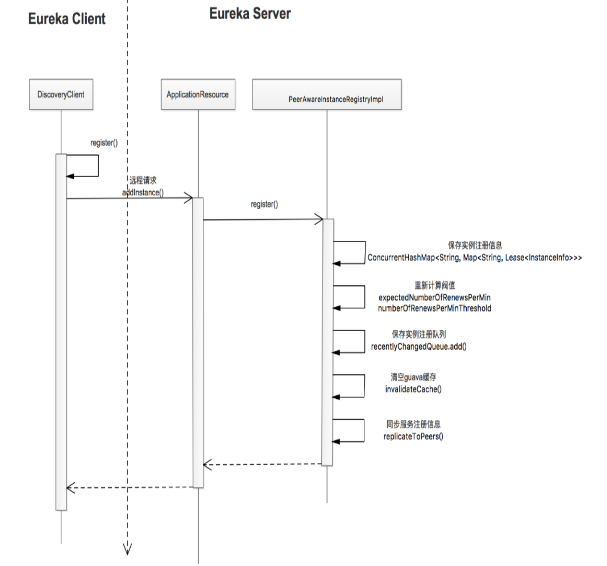
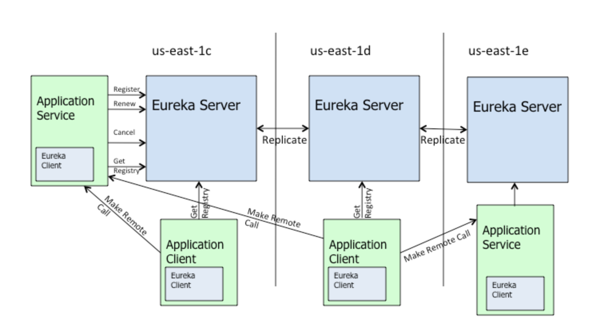
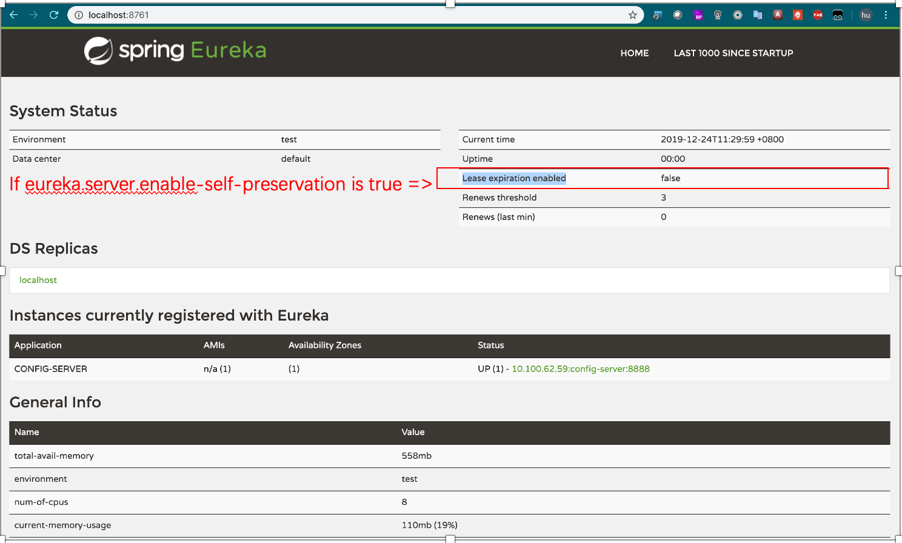
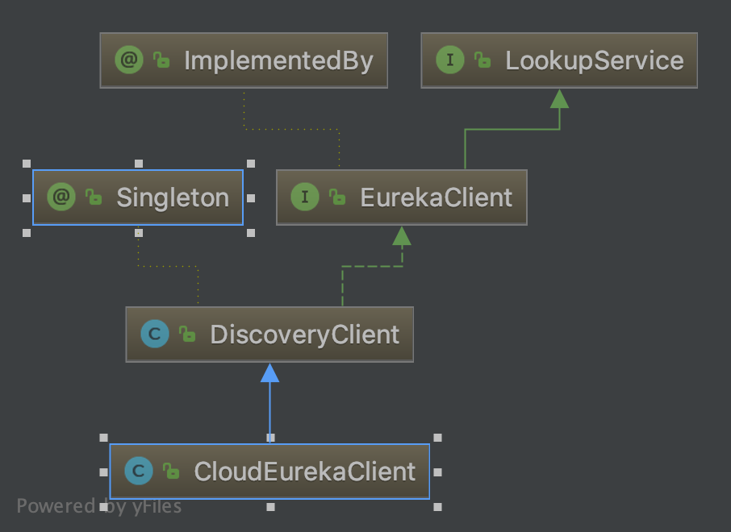
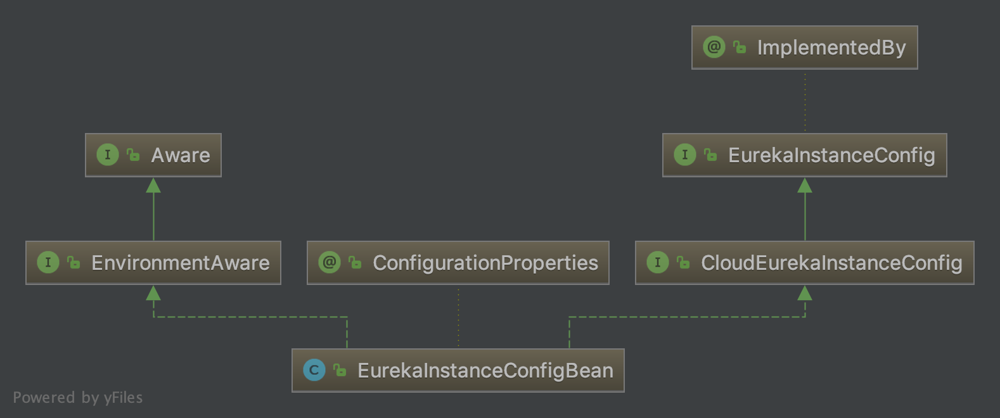
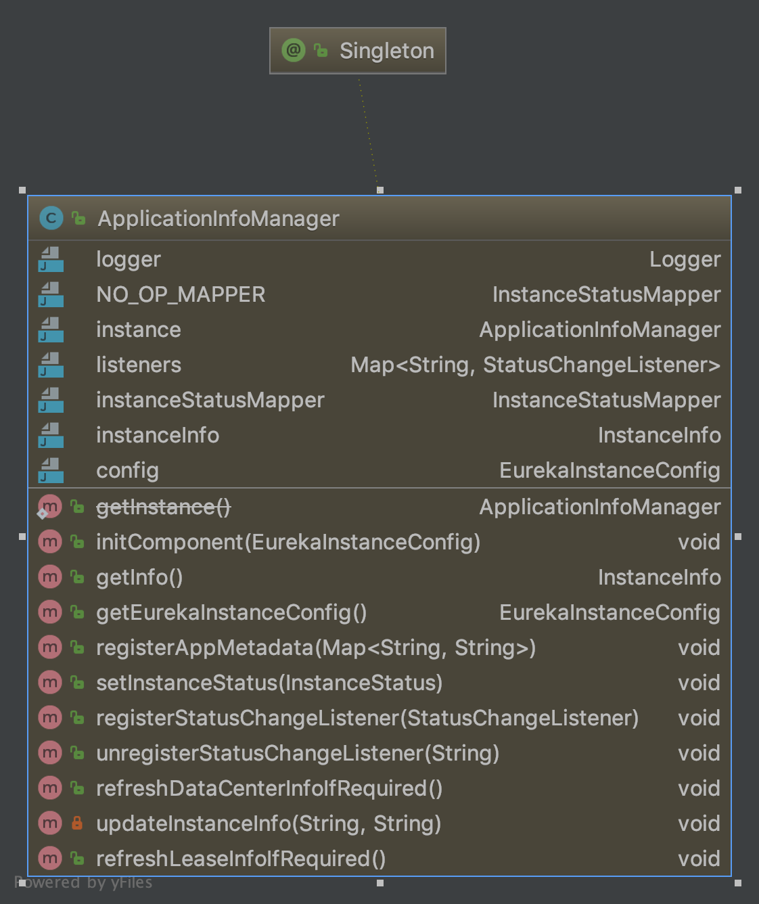

# eureka使用说明

## Eureka的组成 

Eureka分为两部分，Eureka Server和Eureka Client。
Eureka Server作为服务注册表的角色，提供REST API管理服务实例的注册和查询。POST请求用于服务注册，PUT请求用于实现心跳机制，DELETE请求服务注册表移除实例信息，GET请求查询服务注册表来获取所有的可用实例。



## Eureka server

### Eureka server设计原理

Eureka是一个AP的系统，具备高可用性和分区容错性。每个Eureka Client本地都有一份它最新获取到的服务注册表的缓存信息，即使所有的Eureka Server都挂掉了，依然可以根据本地缓存的服务信息正常工作。Eureka Server没有基于quorum 机制实现，而是采用P2P的去中心化结构，这样相比于zookeeper，集群不需要保证至少几台Server存活才能正常工作，增强了可用性。但是这种结构注定了Eureka不可能有zookeeper那样的一致性保证，同时因为Client缓存更新不及时、Server间同步失败等原因，都会导致Client访问不到新注册的服务或者访问到过期的服务。



***所以服务启动一段时间的时候，eureka服务列表已经显示服务了，但是在调用的时候还是出现找不到服务的错误，这个时候需要再等待一会。**

如果Eureka Server和Eureka Client间有网络分区存在(默认的检测机制是15分钟内低于85%的心跳汇报)，Eureka Server会进入自我保护模式，不再把过期服务从服务注册表移除(这种情况下客户端有可能获取已经停止的服务，配合使用Hystrix通过熔断机制来容错和降级，弥补基于客户端服务发现的时效性的缺点)。
可以使用eureka.server.enable-self-preservation=false来禁用自我保护模式。



***eureka发现大量的服务都不可用的时候，或者本地开启了保护模式的时候，服务会不再剔除，所以调用服务的时候可能出现访问不存在的服务**

### Eureka Server代码实现

虽然在原理上，eureka server还是有它的复杂性，但是使用起来非常简单。
在一般的springboot 工程的基础

* 1.增加如下maven 依赖。

```xml
<dependency>
            <groupId>org.springframework.cloud</groupId>
            <artifactId>spring-cloud-starter-netflix-eureka-server</artifactId>
        </dependency>
```

* 2.启动类增加@EnableEurekaServer即可

```java
@SpringBootApplication
@EnableEurekaServer
public class RegistryApplication {
    public static void main(String[] args) {
        SpringApplication.run(RegistryApplication.class, args);
    }
}
```

## Eureka Client

### Eureka Client主要功能

1. 注册服务实例到Eureka Server中
2. 更新与Eureka Server的契约
3. 在服务关闭时从Eureka Server中取消契约
4. 查询在Eureka Server中注册的服务/实例的列表

### Eureka Client的主要类说明





### Eureka Client的实现

1. 增加如下maven 依赖。

```xml
<dependency>
    <groupId>org.springframework.cloud</groupId>
    <artifactId>spring-cloud-starter-netflix-eureka-client</artifactId>
</dependency>
```

2. 使用@SpringCloudApplication 或者@EnableDiscoveryClient

```java
@SpringCloudApplication
public class AuthApplication {
public static void main(String[] args) {
    SpringApplication.run(AuthApplication.class, args);
}
}
```

3. 配置eureka server地址，可以用逗号分隔多个地址

```yaml
eureka:
  instance:
    prefer-ip-address: true
  client:
    serviceUrl:
      defaultZone: http://localhost:8761/eureka/
```