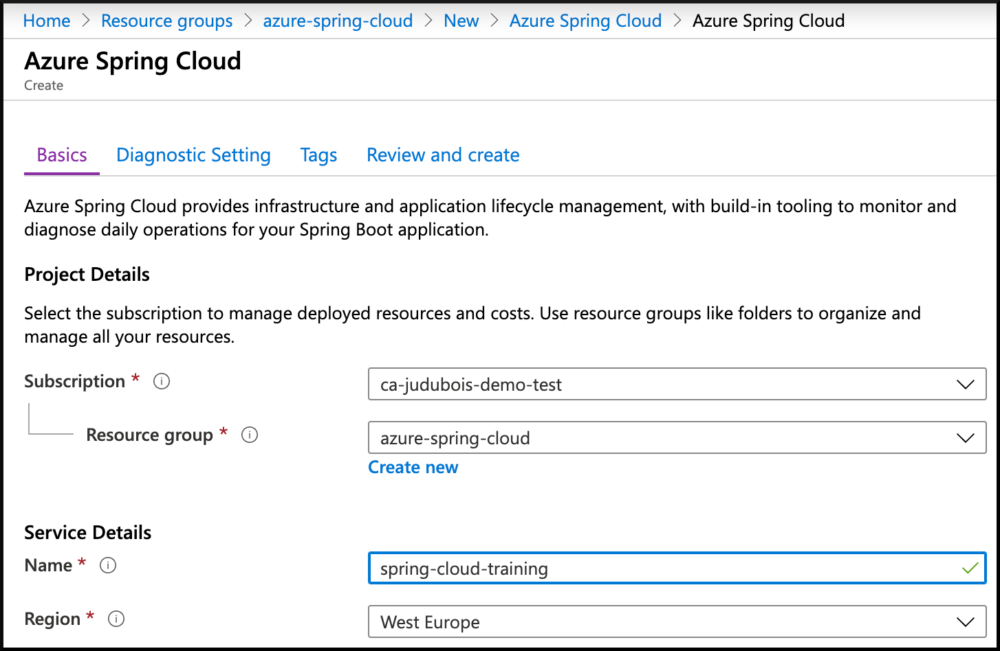
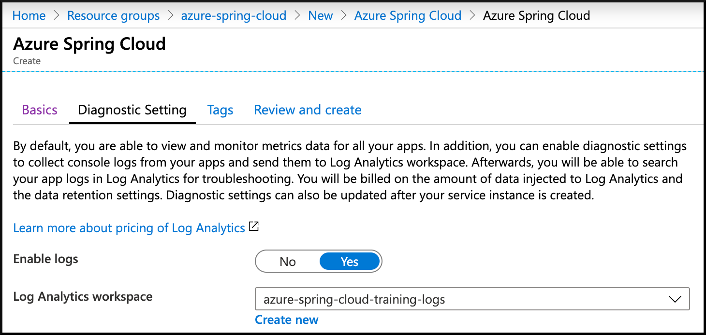
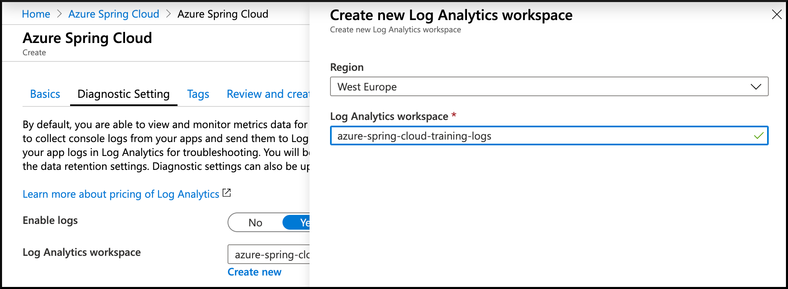
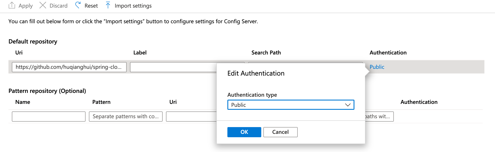

# spring cloud microservice 上azure spring cloud

Build a Spring Boot microservice that is cloud-enabled: 
it uses a Spring Cloud Service Registry and a Spring Cloud Config Server which are both managed and supported by Azure Spring Cloud.

## add azure spring cloud maven dependency

add below dependecy on the parent pom file.

```yaml
<dependency>
    <groupId>com.microsoft.azure</groupId>
    <artifactId>spring-cloud-starter-azure-spring-cloud-client</artifactId>
    <version>2.1.0-SNAPSHOT</version>
</dependency>
```

***rebuild and deploy all the maven projects**

## create azure spring cloud cluster

### Install the CLI and authenticate

Install the [Azure CLI](https://docs.microsoft.com/en-us/cli/azure/install-azure-cli/?WT.mc_id=azurespringcloud-github-judubois) and log in to your account:

```bash
az login
```

Configure the CLI to use Azure subscription you want to use for this training:

```bash
# List all subscriptions
az account list -o table

# Set active subscription
az account set --subscription <target subscription ID>
```

### Install the Azure Spring Cloud CLI extension

To install the Azure Spring Cloud CLI extension, type the following command:

```bash
az extension add --name spring-cloud
```

### Create an Azure Spring Cloud instance

- [Click here](https://portal.azure.com/?WT.mc_id=azurespringcloud-github-judubois&microsoft_azure_marketplace_ItemHideKey=AppPlatformExtension#blade/Microsoft_Azure_Marketplace/MarketplaceOffersBlade/selectedMenuItemId/home/searchQuery/spring%20cloud) to access the cluster creation page.


- Click on "Azure Spring Cloud" and then on "Create".
- Select your subscription, resource group name, name of the service and location.



- Click on "Next : Diagnostic Setting" to go to the next screen.
- Here you can either select an existing "Log Analytics workspace" or create a new one. Create a new one, and we will configure it later in [03 - Configure application logs](../03-configure-application-logs/README.md).





- Once everything is validated, the cluster can be created.

Creating the cluster will take a few minutes.

### Configure the CLI to use that cluster

Using the cluster's resource group and name by default will save you a lot of typing later:

```bash
az configure --defaults group=<resource group name>
az configure --defaults spring-cloud=<service instance name>
```

### Configure Azure Spring Cloud to access the Git repository

- Go to the [the Azure portal](https://portal.azure.com/?WT.mc_id=azurespringcloud-github-judubois).
- Go to the overview page of your Azure Spring Cloud server, and select "Config server" in the menu
- Configure the repository we previously created:
  - Add the repository URL, for example `https://github.com/huqianghui/spring-cloud.git`
  - Click on `Authentication` and select `public`
- Click on "Apply" and wait for the operation to succeeed



### push all config file to the git server.

### deploy local spring cloud applitions to azure spring cloud.

```bash
az spring-cloud app create -n spring-cloud-microservice
```

You can now build your "spring-cloud-microservice" project and send it to Azure Spring Cloud:

```bash
./mvnw clean package -DskipTests -Pcloud
az spring-cloud app deploy -n spring-cloud-microservice --jar-path target/demo-0.0.1-SNAPSHOT.jar
```

### Test the project in the cloud

Go to [the Azure portal](https://portal.azure.com/?WT.mc_id=azurespringcloud-github-judubois):

- Look for your Azure Spring Cloud cluster in your resource group
- Go to "App Management"
  - Verify that `spring-cloud-microservice` has a `Discovery status` which says `UP(1),DOWN(0)`. This shows that it is correctly registered in Spring Cloud Service Registry.
  - Select `spring-cloud-microservice` to have more information on the microservice.
- Copy/paste the "Test Endpoint" that is provided.

You can now use cURL again to test the `/actuator/info` endpoint.
