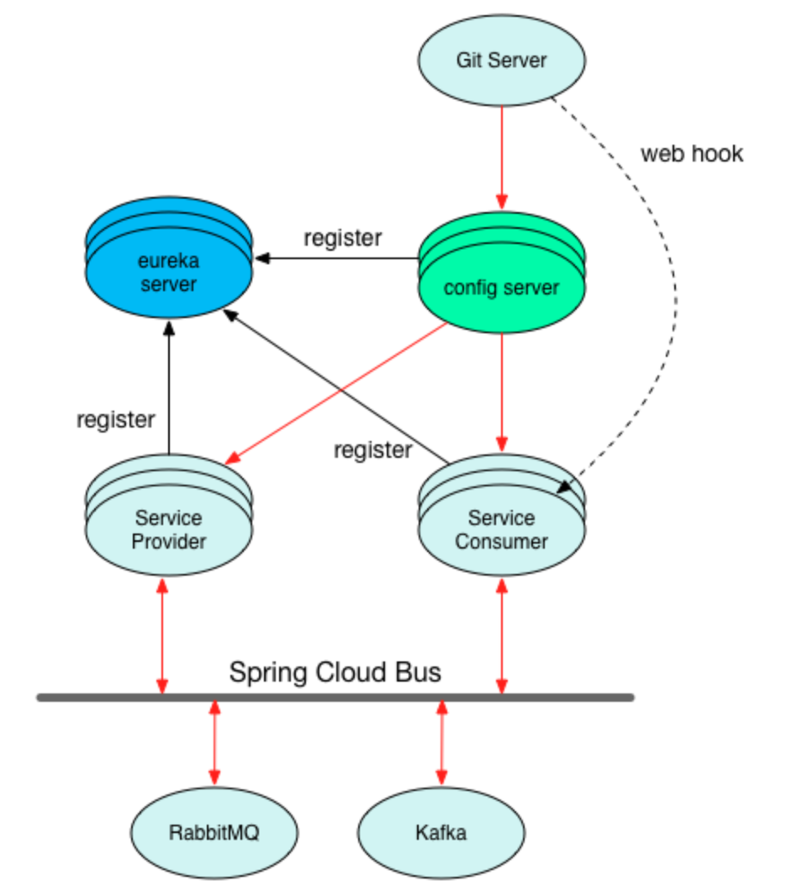
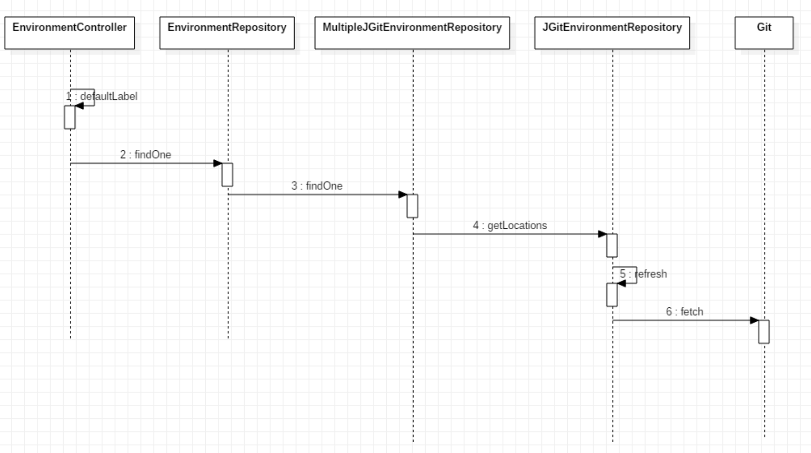
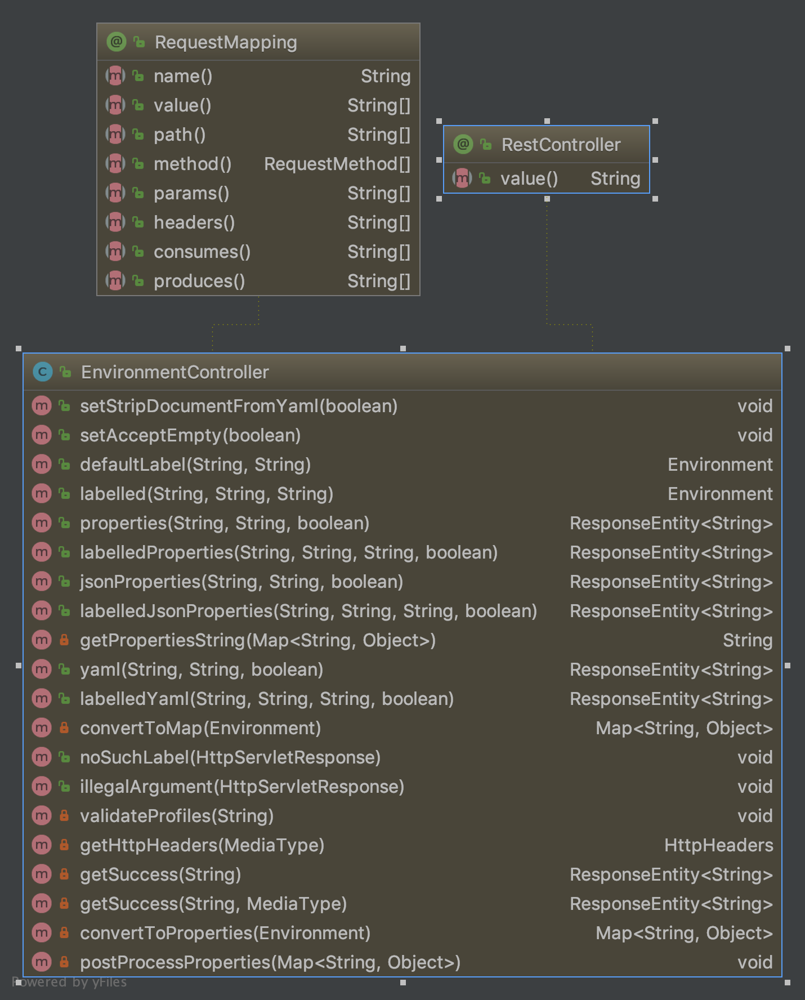

# spring config介绍

Spring Boot有一个非常重要的改变就是简化了配置，在应用中可以使用bootstrap和application的properties 或者yaml文件定义了更多配置。但是配置文件分开管理来还是比较麻烦的，而且环境越多配置约容易出问题。Spring Cloud提供了一种统一配置的方案：Spring Cloud Config Server。

## spring config组成 

Spring Cloud Config项目是一个解决分布式系统的配置管理方案。它包含了Client和Server两个部分。



## spring config Server

### spring config Server主要特性

spring cloud config server本身也是一个微服务，跟其它的微服务一样，也可以注册到eureka server。

* 1.spring cloud config默认是将配置保存在git/svn上 （即：配置当成源代码一样管理）。也可以放到本地或者其他的环境

* 2.spring cloud config没有默认的统一管理界面，既然把配置都当成git之类的源码来看待了，git的管理界面，就是配置的管理界面
  也可以自己开发一个UI来使用

* 3.spring cloud config是依赖git每次push后，触发webhook回调，最终触发spring cloud bus(消息总线），然后由消息总线通知相关的应用



### config Server提供的restful服务

Eureka Server就是提供了一些的endpoint，使用springMVC的controller--EnvironmentController来提供服务


### config Server使用的数据维度

1. 应用名称
2. profile，可以看做环境分类：Dev， Test 等
3. label，各个分支。

同时支持继承方式，可以获取公共配置如application里面的配置。

如下可以直接通过浏览器获取配置数据


### spring config Server的代码实现

* 1.增加maven配置pom文件
  
```xml
<dependency>
    <groupId>org.springframework.cloud</groupId>
    <artifactId>spring-cloud-config-server</artifactId>
</dependency>
```

* 2.启动类增加@EnableConfigServer

```java
@EnableConfigServer
@SpringCloudApplication
public class ConfigApplication {
    public static void main(String[] args) {
        SpringApplication.run(ConfigApplication.class, args);
    }
}
```

* 3.它本身也需要一些配置，放在application.yaml

```yaml
spring:
  application:
    name: config-server
  cloud:
    config:
      server:
        native:
          search-locations: classpath:/shared
  profiles:
     active: native
server:
  port: 8888

eureka:
  instance:
    prefer-ip-address: true
  client:
    serviceUrl:
      defaultZone: http://localhost:8761/eureka/

management: #actuator
  endpoints:
    enable: true
    web:
      exposure:
        include: "*"
```

## spring config Client

client便是在启动的时候，读取server的地址通过自身的参数请求参数，来获取参数，设置到自己的context里面。

注意点：

1. 服务器的配置应该放到bootstrap文件中，它的加载时间比application要早。
2. 默认的服务配置地址localhost:8888。
3. 增加maven 依赖

```xml
<dependency>
    <groupId>org.springframework.cloud</groupId>
    <artifactId>spring-cloud-starter-config</artifactId>
</dependency>
```

配置服务器配置：

```yaml
spring:
  cloud:
    config:
      uri: http://localhost:8888
      fail-fast: true
```
