# 在拆分成微服务之前，需要熟悉一些知识点

## 1. [微服务拆分原则](从单体应用到微服务理论原则.md)

## 2. spring security模块与SSO [认证与授权](springSecurity说明.md)

## 3. spring cloud 技术栈

[服务注册发现](eureka介绍.md)

[服务网关](zuul介绍.md)

[配置中心](springConfigServer介绍.md)

[远程调用FeignClient](SpringCloudFeign介绍.md)

## 4. 更多微服务组件可以按照spring-cloud-entire-solution-example工程

### 应用监控 spring boot admin

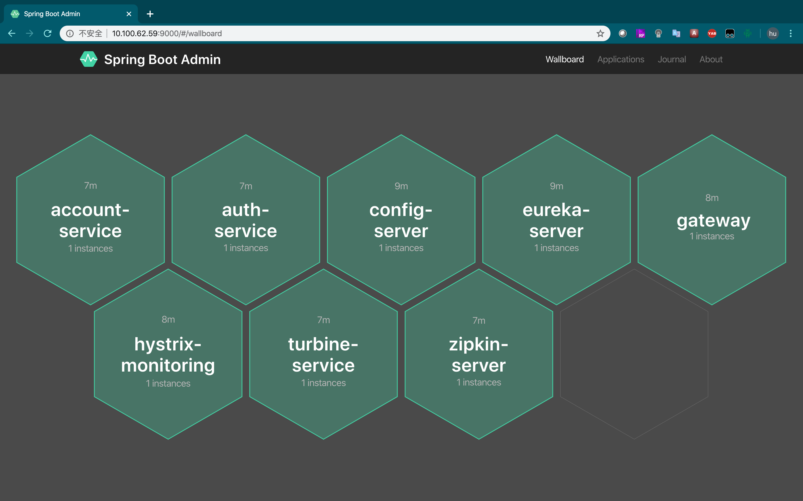

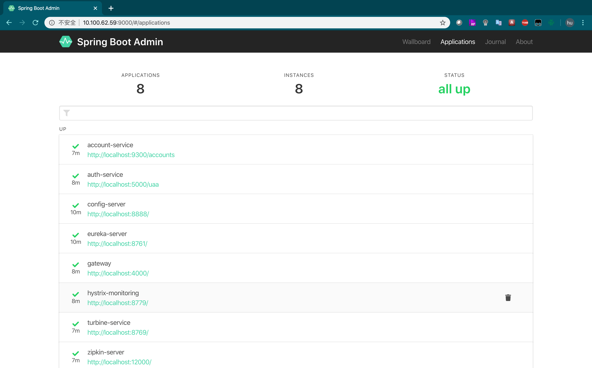

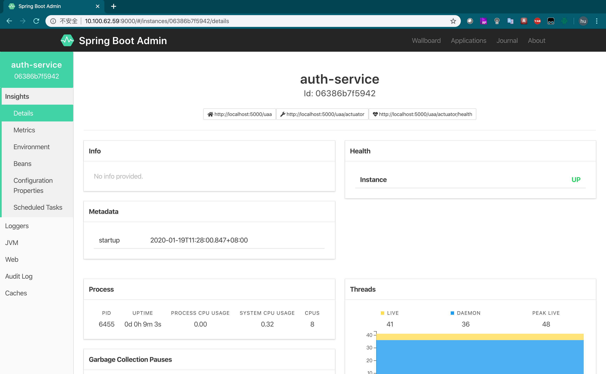

### 限流与熔断hystrix

单个服务
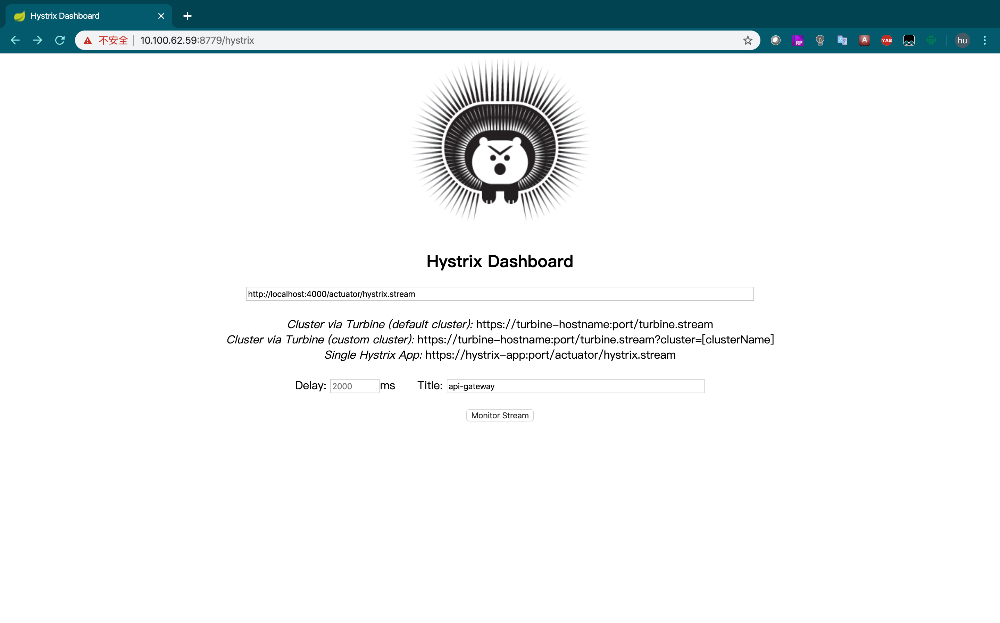

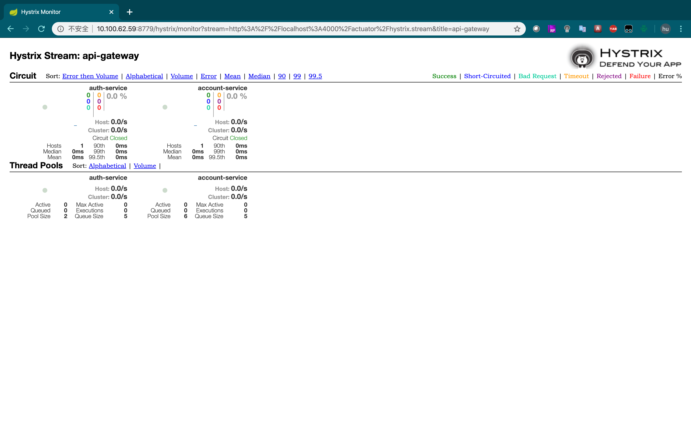

### 集群熔断监控turbine

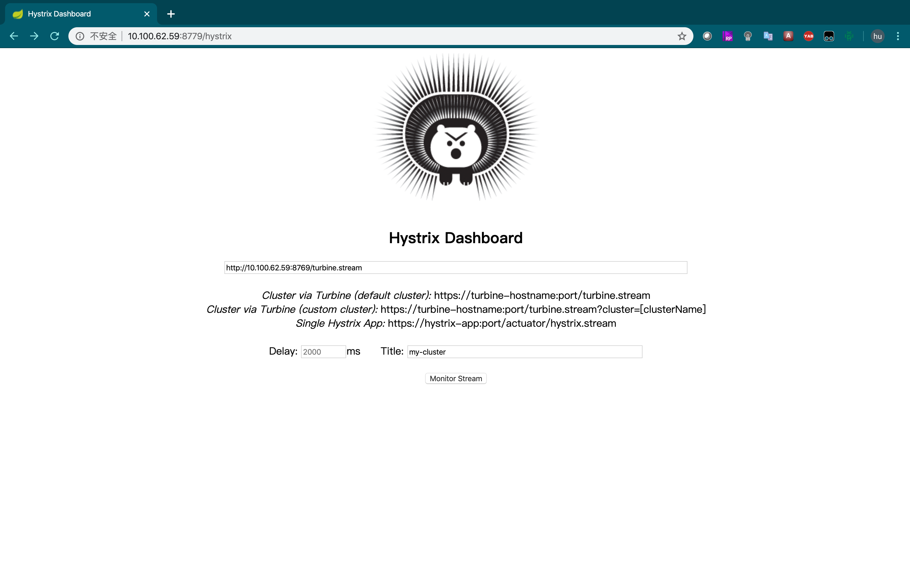

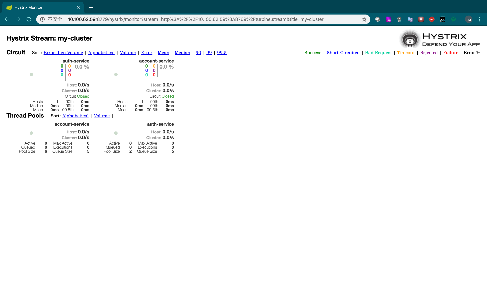

### 链路监控zipkin


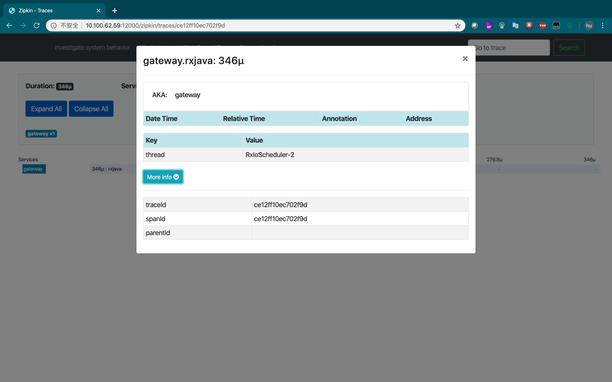

### 应用日志（ELK 没有）

## 5. 查看页面http请求来分析


根据以上分析，可以把这个简单应用拆分成三个应用：

a. 本身这个业务服务account-service

b. 认证服务oauth-service

c. 静态资源服务器（在这个例子中，我们使用api-gateway作为静态资源服务器）

通过上面springCloud的了解，我们还需要引入如下几个服务：

d. 服务注册发现--eureka

e. 配置中心--spring cloug config

通过这五个模块，可以完成一个最基本的spring cloud的微服务集群。

## 6. 五个微服务模块的初始化

### 快速创建的spring boot 应用工程

快速创建SpringBoot项目可以通过以下三种方式：

1) [SpringIO官网创建](https://start.spring.io/)
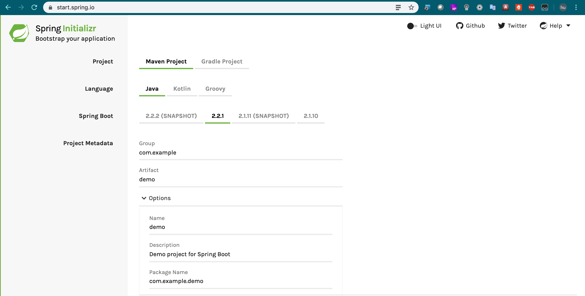

2）使用IDEA创建

新建Spring Initializr项目


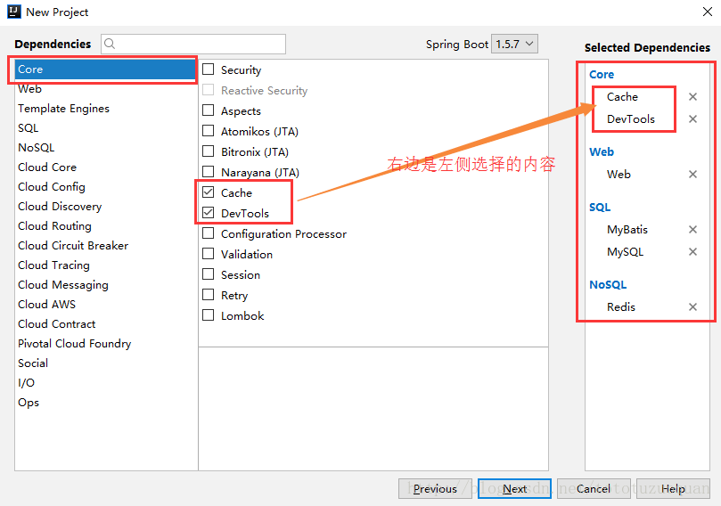


3） spring脚本安装
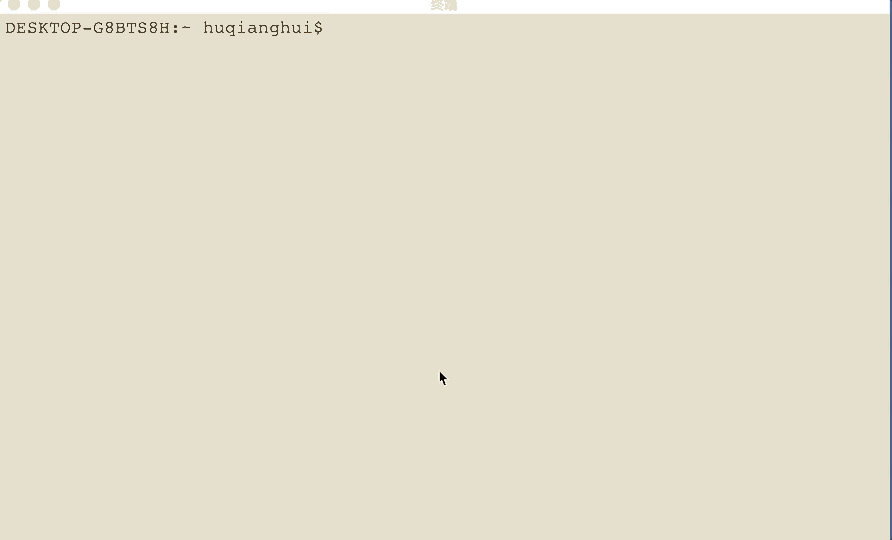

### 7. 使用maven parent project来统一管理五个工程和版本

pom文件大致内容如下：

```xml
<project xmlns="http://maven.apache.org/POM/4.0.0" 
xmlns:xsi="http://www.w3.org/2001/XMLSchema-instance" xsi:schemaLocation="http://maven.apache.org/POM/4.0.0 http://maven.apache.org/xsd/maven-4.0.0.xsd">
<modelVersion>4.0.0</modelVersion>

<groupId>com.seattle.msready</groupId>
<artifactId>spring-cloud-example</artifactId>
<version>1.0-SNAPSHOT</version>
<packaging>pom</packaging>
<name>spring-cloud-example</name>

<parent>
    <groupId>org.springframework.boot</groupId>
    <artifactId>spring-boot-starter-parent</artifactId>
    <version>2.1.7.RELEASE</version>
    <relativePath/>
    <!-- lookup parent from repository -->
</parent>

<!--START Define SpringCloud version and dependency -->
<properties>
    <project.build.sourceEncoding>UTF-8</project.build.sourceEncoding>
    <spring-cloud.version>Greenwich.SR3</spring-cloud.version>
    <java.version>1.8</java.version>
</properties>

<dependencyManagement>
    <dependencies>
        <dependency>
            <groupId>org.springframework.cloud</groupId>
            <artifactId>spring-cloud-dependencies</artifactId>
            <version>${spring-cloud.version}</version>
            <type>pom</type>
            <scope>import</scope>
        </dependency>
    </dependencies>
</dependencyManagement>
<!--END Define SpringCloud version and dependency -->

<repositories>
    <repository>
        <id>nexus-snapshots</id>
        <url>https://oss.sonatype.org/content/repositories/snapshots/</url>
        <snapshots>
            <enabled>true</enabled>
        </snapshots>
    </repository>
</repositories>

<!--START Define public dependency -->
<dependencies>
    <dependency>
        <groupId>org.springframework.boot</groupId>
        <artifactId>spring-boot-starter-web</artifactId>
    </dependency>
    <dependency>
        <groupId>org.springframework.cloud</groupId>
        <artifactId>spring-cloud-starter</artifactId>
    </dependency>
    <dependency>
        <groupId>org.springframework.boot</groupId>
        <artifactId>spring-boot-starter-actuator</artifactId>
    </dependency>
    <dependency>
        <groupId>org.springframework.cloud</groupId>
        <artifactId>spring-cloud-starter-netflix-hystrix</artifactId>
    </dependency>
    <dependency>
        <groupId>org.springframework.boot</groupId>
        <artifactId>spring-boot-starter-test</artifactId>
        <scope>test</scope>
    </dependency>
</dependencies>
<!--END Define public dependency -->

<!--START Define function modules -->
<modules>
    <module>gateway</module>
    <module>auth-service</module>
    <module>account-service</module>
    <module>spring-config-server</module>
    <module>eureka-server</module>
</modules>
<!--END Define function modules -->

<build>
    <plugins>
        <plugin>
            <groupId>org.springframework.boot</groupId>
            <artifactId>spring-boot-maven-plugin</artifactId>
        </plugin>
    </plugins>
</build>

</project>
```
