# spring cloud microservice 上azure spring cloud

Build a Spring Boot microservice that is cloud-enabled: 
it uses a Spring Cloud Service Registry and a Spring Cloud Config Server which are both managed and supported by Azure Spring Cloud.

## add azure spring cloud maven dependency

### 1. add below dependecy on the parent pom file,and remove the spring-config-server and eureka-server modules.

```xml
<dependency>
    <groupId>com.microsoft.azure</groupId>
    <artifactId>spring-cloud-starter-azure-spring-cloud-client</artifactId>
    <version>2.1.0-SNAPSHOT</version>
</dependency>
```

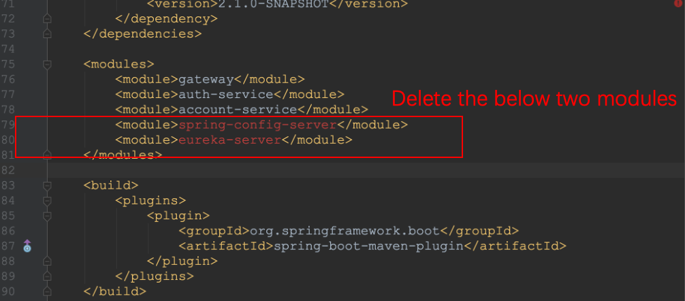

### 2. Delete the eureka server and original config server code but keep the config files in the shared folder: './spring-config-server/src/main/resources/shared'

Remove the spring-config-server and eureka-server modules.


### 3. Delete the server port and application name config in the config files

Because the below config files just have the server port configuration, so you can delete them, or just left blank.

`./spring-config-server/src/main/resources/shared/account-service.yml`

`./spring-config-server/src/main/resources/shared/auth-service.yml`

In the below config file

`./spring-config-server/src/main/resources/shared/application.yml`

the eureka config should be removed.

The config code as below:

```yaml
logging:
  level:
    org.springframework.security: INFO

hystrix:
  command:
    default:
      execution:
        isolation:
          thread:
            timeoutInMilliseconds: 300000

feign:
  hystrix:
    enabled: true

management: #actuator
  endpoints:
    enable: true
    web:
      exposure:
        include: "*"
```

In the config file

`./spring-config-server/src/main/resources/shared/gateway.yml`

the server port also need to be deleted. And the Auth server Url will be changed later.

The code as below:

```yaml
zuul:
  ignoredServices: "*"
  host:
    connect-timeout-millis: 300000
    socket-timeout-millis: 300000
  routes:
    auth-service:
      path: /oauth/**
      serviceId: auth-service
      stripPrefix: false
      sensitiveHeaders:
    account-service:
      path: /accounts/**
      serviceId: account-service
      stripPrefix: false
      sensitiveHeaders:
security:
  oauth2:
    client:
      clientId: gateway
      accessTokenUri: http://localhost:5000/oauth/token
      grant-type: client_credentials
      scope: server
    resource:
      user-info-uri: http://localhost:5000/users/current

hystrix:
  command:
    default:
      execution:
        isolation:
          thread:
            timeoutInMilliseconds: 300000

ribbon:
  ReadTimeout: 300000
  ConnectTimeout: 300000
```

> **Notes**: If the micro-service application name which you have config in the \*-service/src/main/resources/application.yml is diffrent from the name you would config in the azure, then you should delete it. If they are same,you can keep it.

**Go to the exercise root folder, rebuild and install all the maven projects**

***rebuild and install all the maven projects**

## create azure spring cloud cluster

### Install the CLI and authenticate

Install the [Azure CLI](https://docs.microsoft.com/en-us/cli/azure/install-azure-cli/?WT.mc_id=azurespringcloud-github-judubois) and log in to your account:

```bash
az login
```

Configure the CLI to use Azure subscription you want to use for this training:

```bash
# List all subscriptions
az account list -o table

# Set active subscription
az account set --subscription <target subscription ID>
```

### Install the Azure Spring Cloud CLI extension

To install the Azure Spring Cloud CLI extension, type the following command:

```bash
az extension add --name spring-cloud
```

### Create an Azure Spring Cloud instance

- [Click here](https://portal.azure.com/?WT.mc_id=azurespringcloud-github-judubois&microsoft_azure_marketplace_ItemHideKey=AppPlatformExtension#blade/Microsoft_Azure_Marketplace/MarketplaceOffersBlade/selectedMenuItemId/home/searchQuery/spring%20cloud) to access the cluster creation page.

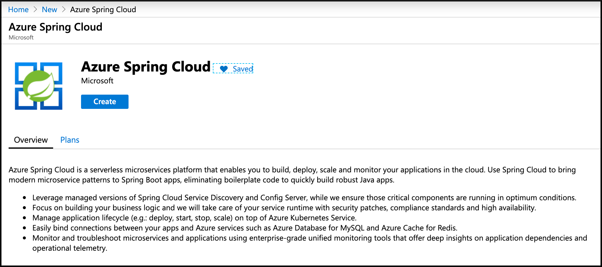

- Click on "Azure Spring Cloud" and then on "Create".
- Select your subscription, resource group name, name of the service and location.

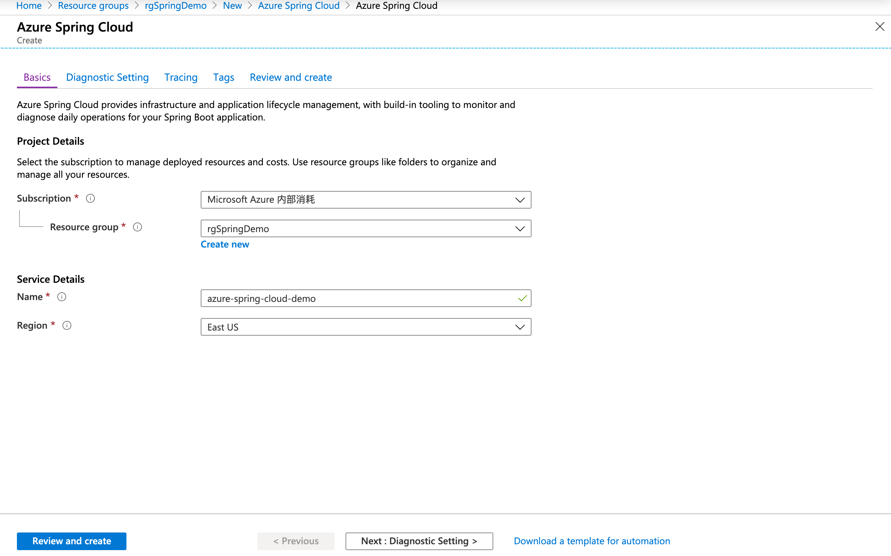

- Click on "Next : Diagnostic Setting" to go to the next screen.
- Here you can either select an existing "Log Analytics workspace" or create a new one. Create a new one, and we will configure it later in [Configure application logs](../03-configure-application-logs/README.md).
- It cost much time.

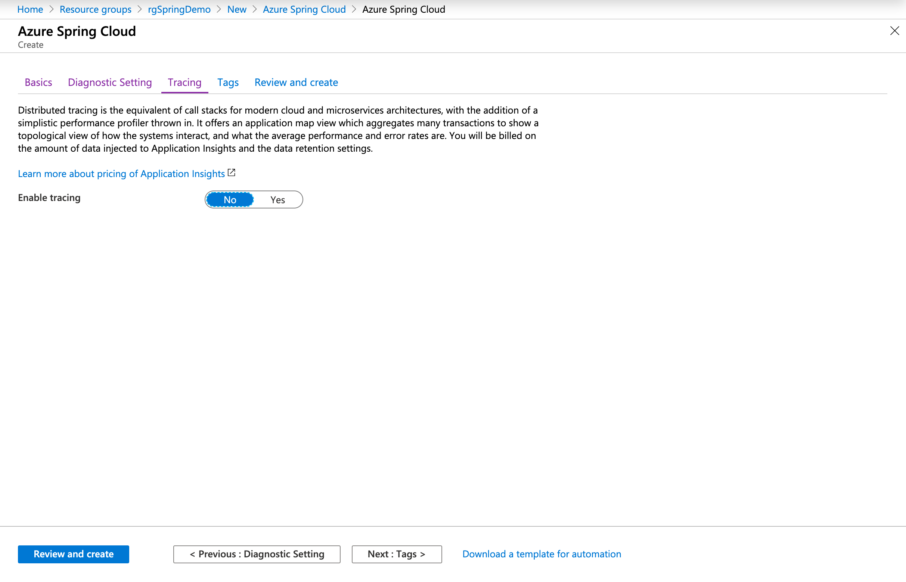

- Once everything is validated, the cluster can be created.

Creating the cluster will take a few minutes.

### Configure the CLI to use that cluster

Using the cluster's resource group and name by default will save you a lot of typing later:

```bash
az configure --defaults group=<resource group name>
az configure --defaults spring-cloud=<service instance name>
```

### Configure Azure Spring Cloud to access the Git repository

- Go to the [the Azure portal](https://portal.azure.com/?WT.mc_id=azurespringcloud-github-judubois).
- remove eureka server config information.
- remove application name and server port configurations.
- Go to the overview page of your Azure Spring Cloud server, and select "Config server" in the menu
- Configure the repository we previously created:
  - Add the repository URL, for example `https://github.com/huqianghui/azure-spring-cloud-demo-config.git`
  - Click on `Authentication` and select `public`
- Click on "Apply" and wait for the operation to succeeed
- Upload the config files to the github server. Here we just use the github as spring cloud's storage repostory.

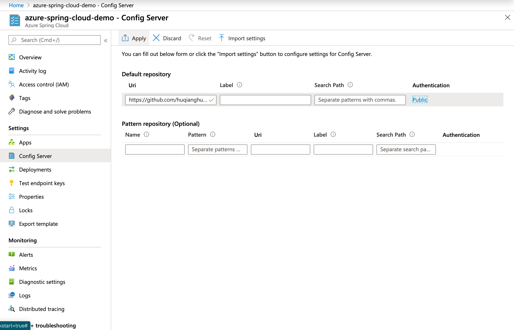

### push all config file to the git server

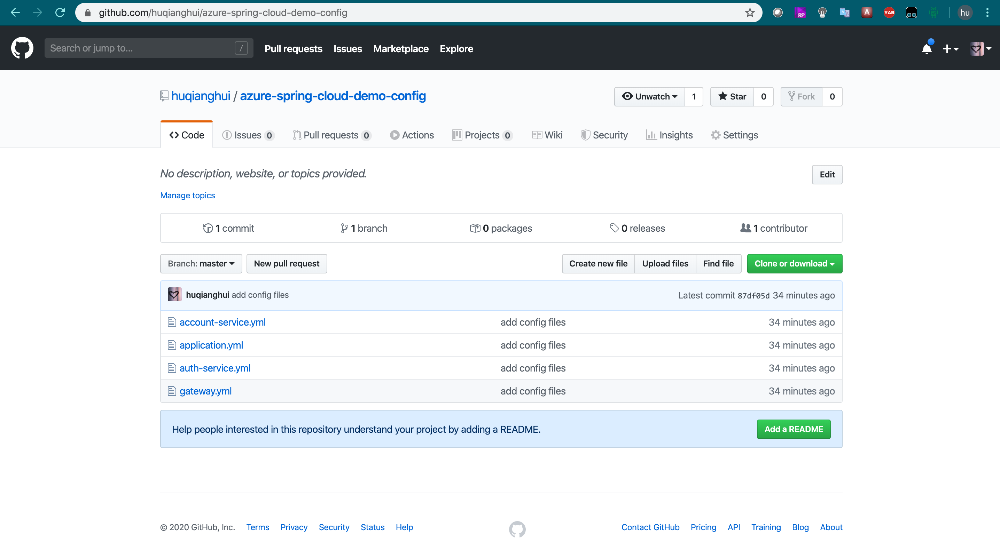

### deploy local spring cloud applitions to azure spring cloud

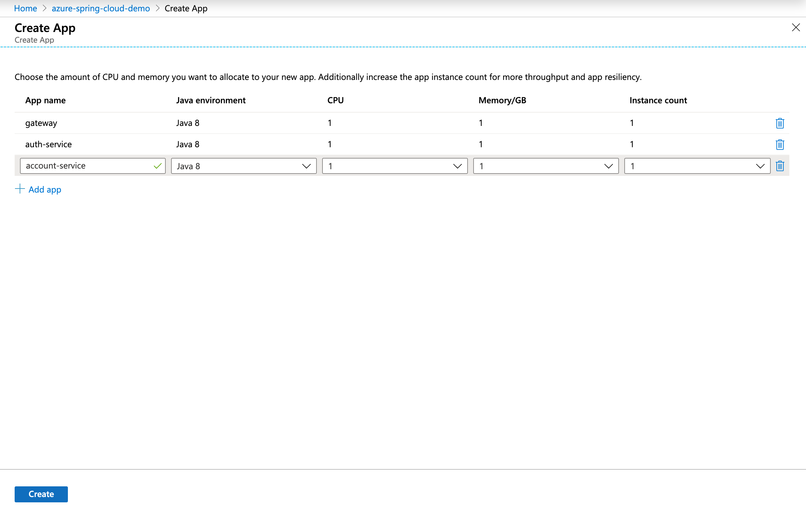

You can now  send the project jars to Azure Spring Cloud:

```bash
az spring-cloud app deploy -n gateway --jar-path ./gateway/target/gateway-1.0-SNAPSHOT.jar

az spring-cloud app deploy -n account-service --jar-path ./account-service/target/account-service-1.0-SNAPSHOT.jar

az spring-cloud app deploy -n auth-service --jar-path ./auth-service/target/auth-service-1.0-SNAPSHOT.jar

```

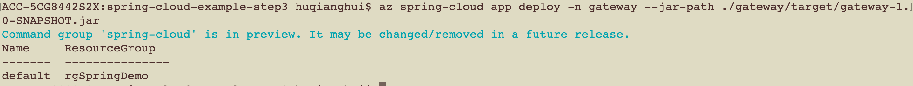

### Test the project in the cloud

Go to [the Azure portal](https://portal.azure.com/?WT.mc_id=azurespringcloud-github-judubois):

- Look for your Azure Spring Cloud cluster in your resource group

- Go to "App Management"
  - Verify that `gateway,account-service,auth-service` has a `Discovery status` which says `UP(1),DOWN(0)`. This shows that it is correctly registered in Spring Cloud Service Registry.
  - Select `gateway,account-service,auth-service` to have more information on the microservice.

It takes a few minutes to finish deploying the applications. To confirm that they have deployed, go to the Apps blade in the Azure portal. You should see a line each of the three applications.

- assign url to auth-server


- change the auth server address in the gateway.application
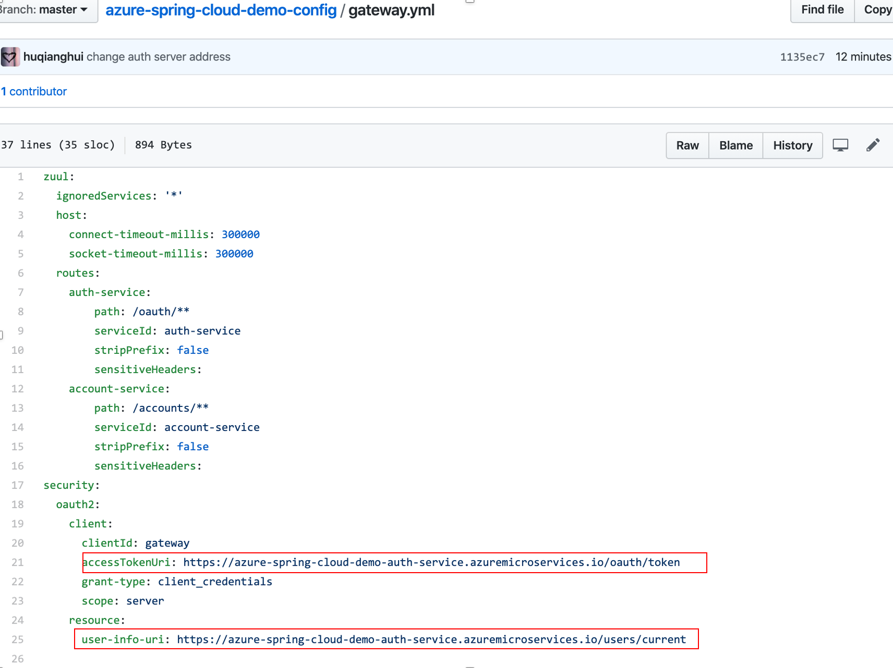

- truobe-shooting: If you enable the diagnostic, you can watch the application log.

```sql

AppPlatformLogsforSpring
| where AppName == 'auth-service' and Log contains "Caused by"
| order by TimeGenerated  desc nulls last 
| limit 50

```

- monitor the app status, if they are running, then you can test it.

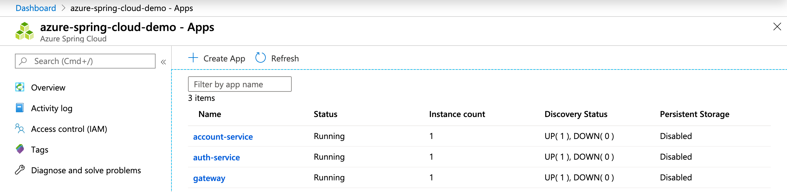

- Assign a public endpoint to the gateway

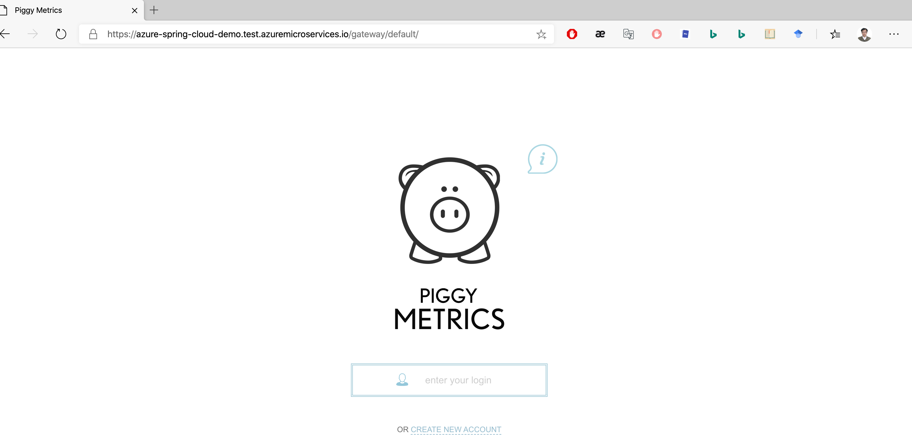