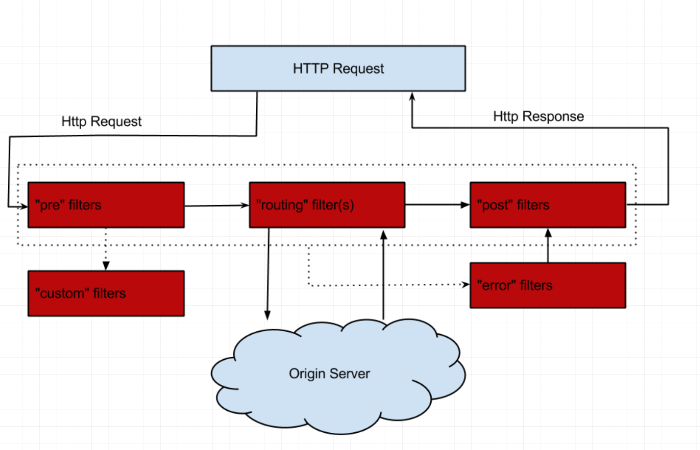
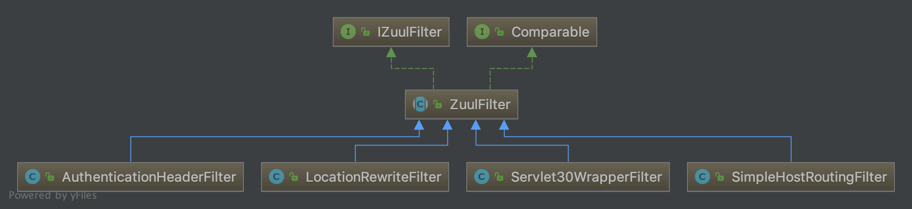
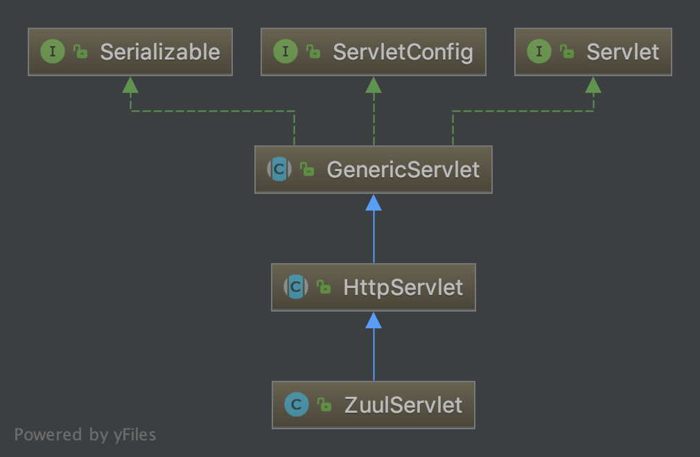

# Spring cloud zuul

## 网关介绍 

API Gateway是一个服务器，也可以说是进入系统的唯一节点。这跟面向对象设计模式中的Facade模式很像。
API Gateway封装内部系统的架构，并且提供API给各个客户端。
它还可能有如下的几个功能：

1. 身份验证和安全性 ： 识别每个资源的身份验证需求，并拒绝不满足它们的请求

2. 监控 ： 在边缘跟踪有意义的数据和统计数据，以便给我们一个准确的生产视图

3. 动态路由 ： 动态路由请求到不同的后端集群

4. 压力测试 ： 逐渐增加集群的流量，以评估性能

5. 限流 ： 为每种请求类型分配容量，并丢弃超过限制的请求

6. 静态响应处理 ： 直接在边缘构建一些响应，而不是将它们转发到内部集

## spring cloud zuul 介绍

Zuul使用了一系列不同类型的过滤器，使我们能够快速灵活地将功能应用到服务中。



### spring cloud 核心类

zuulfilter：


ZuulServlet:


## spring cloud zuul代码实现

* 1.在一个spring boot 基础之上增加maven依赖

```xml
<dependency>
    <groupId>org.springframework.cloud</groupId>
    <artifactId>spring-cloud-starter-netflix-zuul</artifactId>
  </dependency>
```

* 2. 在启动类上增加@EnableZuulProxy

```java
@SpringCloudApplication
@EnableZuulProxy
public class GatewayApplication {
public static void main(String[] args) {
  SpringApplication.run(GatewayApplication.class, args);
}
}
```

* 3.默认可以通过服务名字转发，但是如果不想修改原来系统的URl，可以自己来配置路由规则

```yaml
zuul:
  ignoredServices: '*'
  host:
    connect-timeout-millis: 300000
    socket-timeout-millis: 300000
  routes:
    auth-service:
        path: /auth/**
        serviceId: auth-service
        stripPrefix: false
        sensitiveHeaders:
    account-service:
        path: /accounts/**
        serviceId: account-service
        stripPrefix: false
        sensitiveHeaders:
```