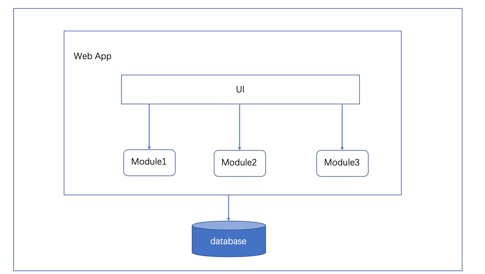
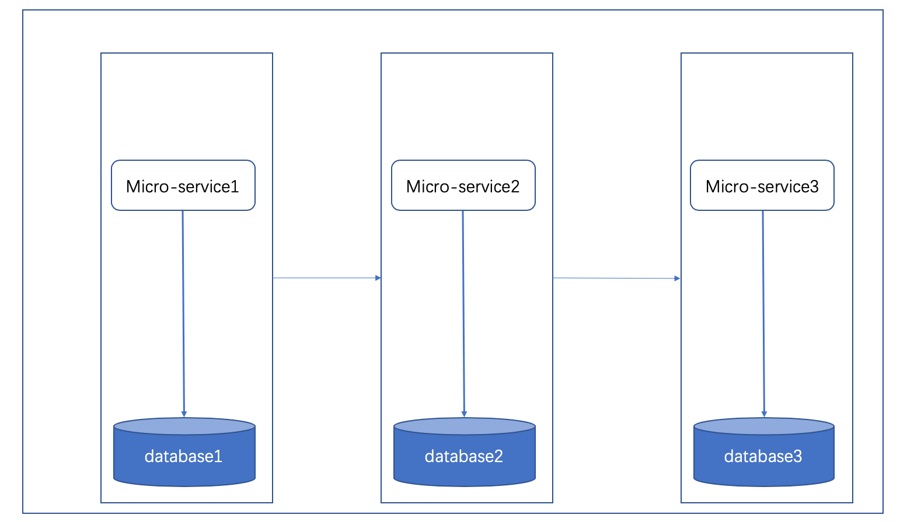
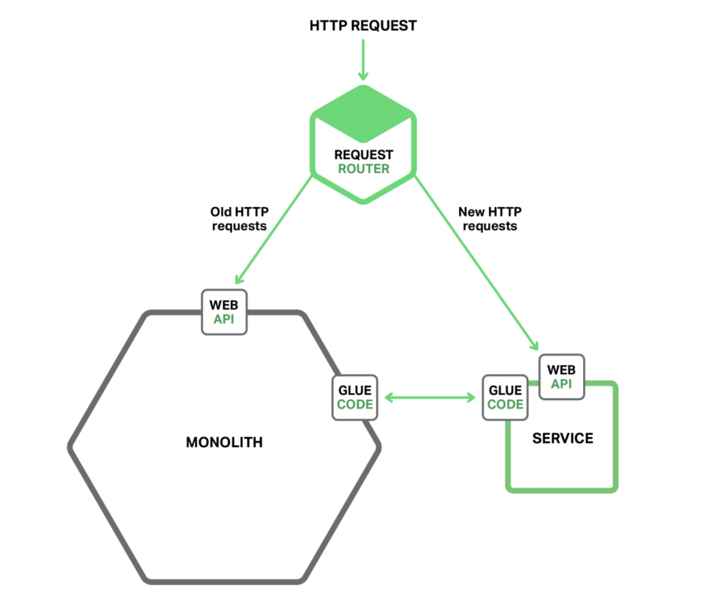
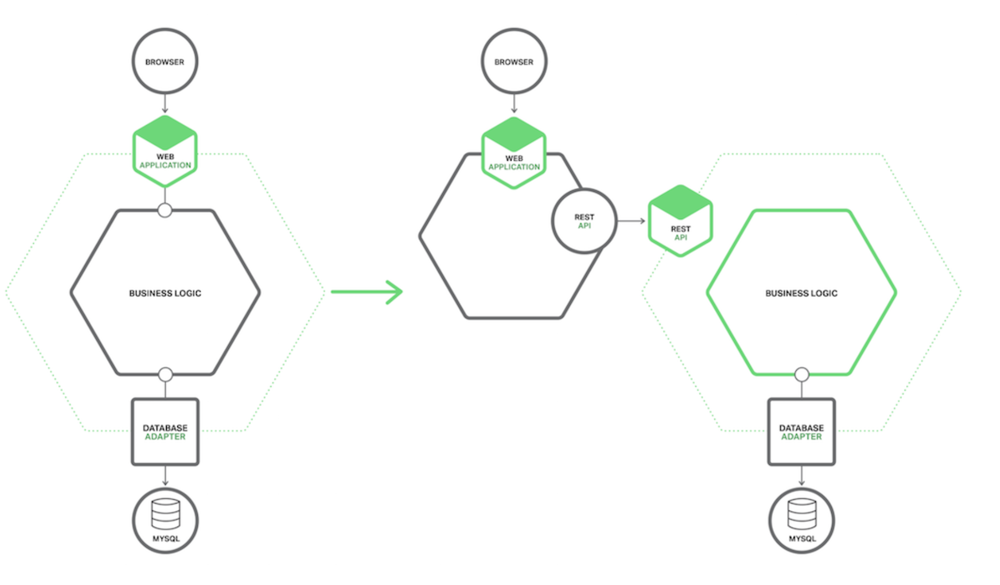
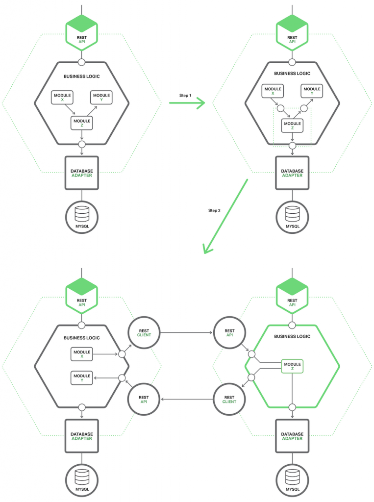
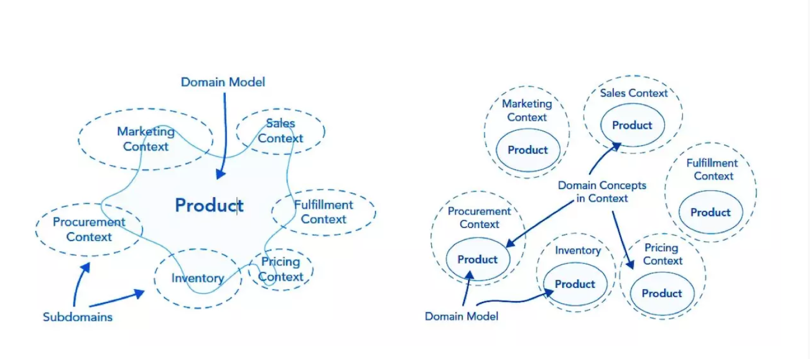

# 从单体应用到单体微服务

## 单体应用

通俗地讲，“单体应用（monolith application）”就是将应用程序的所有功能都打包成一个独立的单元，可以是 JAR、WAR、EAR 或其它归档格式。

单体应用有如下优点：

1. 便于共享：单个归档文件包含所有功能，便于在团队之间以及不同的部署阶段之间共享。

2. 易于测试：单体应用一旦部署，所有的服务或特性就都可以使用了，这简化了测试过程，因为没有额外的依赖，每项测试都可以在部署完成后立刻开始。

3. 易于部署：只需将单个归档文件复制到单个目录下。

但是，不管如何模块化，单体应用最终都会因为团队壮大、成员变动、应用范围扩展等出现问题。下面是单体应用的一些不足：

1. 复杂性高：由于是单个归档文件，所以整个项目文件包含的模块非常多，导致模块的边界模糊、依赖关系不清晰、代码的质量参差不齐，混乱的堆在一起，使得整个项目非常复杂。以致每次修改代码，都非常小心，可能添加一个简单的功能，或者修改一个Bug都会带来隐藏的缺陷。

2. 技术债务：随着时间的推移、需求的变更和技术人员的更替，会逐渐形成应用程序的技术债务，并且越积越多。

3. 扩展能力受限：单体应用只能作为一个整体进行扩展，无法根据业务模块的需要进行伸缩。

4. 阻碍技术创新：对于单体应用来说，技术是在开发之前经过慎重评估后选定的，每个团队成员都必须使用相同的开发语言、持久化存储及消息系统

而随着业务需求的快速发展变化，敏捷性、灵活性和可扩展性需求不断增长，迫切需要一种更加快速高效的软件交付方式。

## 微服务

微服务就是一种可以满足这种需求的软件架构风格。

单体应用被分解成多个更小的服务，每个服务有自己的归档文件，单独部署，然后共同组成一个应用程序。
这里的“微”不是针对代码行数而言，而是说服务的范围限定到单个功能。

这样的话，可以得到优点如下：

1. 易于开发和维护：一个微服务只会关注一个特定的业务功能，所以业务清晰、代码量较少。开发和维护单个微服务相对简单。

2. 单个微服务启动较快

3. 局部修改容易部署：单体应用只要有修改，就得重新部署整个应用。微服务解决了这样的问题。一般来说，对某个微服务进行修改，只需要重新部署这个服务即可。

4. 技术栈不受限制：在微服务架构中，可以结合项目业务及团队的特点，合理的选择技术栈。

5. 按需伸缩：可根据需求，实现细粒度的扩展

通过也带来了一些缺点：

1. 运维要求高：更多的服务意味着要投入更多的运维。

2. 分布式固有的复杂性：使用微服务构建的是分布式系统。对于一个分布式系统，系统容错、网络延迟、分布式事务等都会带来巨大的问题。

3. 接口调整成本高：微服务之间通过接口进行通信。如果修改某一个微服务的API，可能所有用到这个接口的微服务都需要进行调整

为了克服微服务的上述缺点，在实践中总结出来的十二要素原则可以，提供设计参考。

### 微服务应用12要素原则

“12要素”英文全称是The Twelve-Factor App，来源于Heroku平台的实践。
Heroku平台创始人Adam Wiggins汇总了这些实践经验，发布了一个“十二要素应用宣言（The Twelve-Factor App）”。
英文原版地址：https://www.12factor.net/

“十二要素应用宣言”这套理论适用于任意语言和后端服务应用程序，同样也可以作为微服务应用的参考方法论。
微服务应用的特征就是需要遵循一套设计契约，同时微服务应用所面临的高自动化、容器驱动型、基础设施管理等环境也对编写方式提出了要求。
微服务开发人员必须改变自己的编程习惯来满足自动化、容器和基础设施管理的要求。
这需要在开发运维人员与微服务应用之间创建出一套用于指导应用程序运行的新型“契约”。
这套理想的“契约”机制大部分就存在于“应用十二要素”中所提出的基本原则中，其内容包括：（1）基准代码；（2）依赖；（3）配置；（4）后端服务；（5）构建、发布、运行；（6）进程；（7）端口绑定；（8）并发；（9）易处理；（10）环境等价；（11）日志；（12）管理进程等12项。

#### 1.基准代码

对于微服务应用程序的源码管理，必须要有统一的版本控制中心。这样可以实现在版本控制代码库中追踪每一个部署的微服务应用。
从源头就要控制好版本管理，这样后面发布的信息都跟踪。

#### 2. 依赖

对于每个微服务，要声明所依赖的编译包和运行包清单，便于构建工具能很正确地构造微服务应用，例如Maven的pom.xml文件、Gradle的build.gradle文件。这是编译和构造过程的显式声明依赖关系。

业务微服务之间也要明确相互之间的依赖关系，可以通过一些服务编制和服务编排相关框架平台来实现。这是业务层面上的显式依赖关系。

***同时也可以把微服务之间的依赖转化为编译包的依赖。通过feign之类的申明方式***

#### 3. 配置

微服务应用的代码分为两类。一类是程序源码，一类是配置代码。任何部署之间的差异都可以视为配置编码类。微服务应用的配置代码存储在环境中，而不是将其提交到存储库。严格区分程序源码和配置代码的产生机制和管理机制。
在微服务应用的程序源码避免使用与环境信息关联的硬编码。

#### 4. 后端服务

微服务组件依赖的服务都归属为依赖资源，依赖资源包括后端服务、第三方服务，甚至是其他微服务。后端服务包括且不限于数据库服务、消息/队列、缓冲服务、目录服务、邮件服务、数据存储服务等。

微服务组件只关注内部微服务的实现，同时仅需要了解外部资源提供的接口，而不用详细了解外部依赖资源的具体实现。

微服务组件内部不应该具有依赖资源的功能，如果有这方面的需要，通过接口引用外部的依赖资源来实现资源重用，但容错、容灾和备份等特殊要求除外。

微服务所依赖的资源都是完全可移植的，并且可以松散地耦合地整合其他类似资源。

#### 5. 构建、发布、运行

严格分离构建和运行。
微服务应用严格区分构建、发布、运行这3个阶段。其明确的区别在于，构建阶段就是微服务应用就是通过自动或手动方式，把微服务源码形成微服务组件（可独立运行的二进制程序）。发布阶段是把微服务组件放置到对应的发布库（如容器镜像）上，提供给外部运行环境来下载。运行阶段把微服务组件部署到对应的运行环境中。

使用持续集成/持续交付（CI / CD）工具来自动构建、发布和运行三个阶段的工作。例如，容器镜像可以轻松分离构建和发布阶段。理想情况下，微服务源码每次被编译形成组件后，提交到容器镜像，并被视为发布工作。同时，每次从容器镜像获取微服务组件并移植到运行环境中，都视为部署工作。这几个过程与容器的Build-Ship-Run阶段完全吻合。

三个阶段持续运行过程中，前一个阶段的任何一点改动，都认为是微服务应用的整体改变，需要重新确定新的、唯一的版本发布ID。

#### 6. 进程

以一个或多个无状态进程运行应用。

微服务最好地无状态且共享的，任何有状态的服务信息都持久化到后端服务中（如缓存、对象存储、关系数据存储等）。这样可以实现随意启动和立刻停止微服务，也不会有数据丢失的情况发生。

由于服务无状态，可以通过简单地添加更多无状态的服务实例来轻松扩展微服务。将任何有状态的数据或需要在实例之间共享的数据都存储在后端服务中。

微服务组件在设计时就必须按照随时随地会失败或者宕掉来设计。这种设计可以实现微服务进程会被随时拉起或消失，特别是在弹性扩容阶段。

#### 7. 端口绑定

微服务统一通过暴露端口来提供服务，尽量避免通过本地文件或进程来通信，每种端口服务通过服务发现机制而对外提供服务。

微服务通过端口提供的服务。不同的端口绑定不同支持请求协议（包括HTTP、RPC、XMPP、Redis 协议等），监听所有发送至该端口的请求。

#### 8. 并发

微服务架构借鉴Unix进程模型实现。虽然微服务应用本身只是一个进程，但可以根据业务分支来开启多个线程以分散进程瓶颈。

对于同一服务功能，可以对应启动多个微服务实例，这样可以实现水平扩展。

#### 9. 易处理

微服务终止是检查所有资源都是否销毁，所有监听都要关闭，释放所有的资源，最后什么也不留下地离开。

当非正常结束时，微服务自动恢复到默认状态上。

#### 10. 环境等价

保持微服务的研发、测试和生产环境尽可能相似，这样可以保证微服务应用的高质量，持续发布和持续部署。

通过容器部署方式来实现微服务的版本化，通过适配器来保证各个不同环境的差异性，同时还能大大减少环境不同带来的排错等成本沟通问题。

对于后台数据，差异性是不可避免的。这需要在开发过程中建立隔离机制。

最好开发运维一体化。

#### 11. 日志

把日志当作事件流。

微服务应用要建立统一的服务日志管理机制。

每个运行的微服务都要求直接标准输出（stdout）和错误输出（stderr）事件流。日志是事件流的汇总，最后形成日志数据源。通过集中服务，执行环境收集、聚合、索引和分析这些日志事件。

采用服务调用链来解决服务之间调用的问题。

通过日志来进行微服务应用的监控。

#### 12. 管理进程

微服务本身应用和微服务的后台管理应用要严格分离。这两者采用的技术架构、框架和实现都不一样。

微服务管理或维护系统是微服务应用维护的基础部分，要作为一次性程序运行。

### 将单体应用改造为微服务

#### 1. 停止让单体应用继续变大，也就是在实现新功能的时候，不应该再增加代码。

这一策略的理念在于，把这部分新代码开发称为独立的微服务。下图展示了采用此方法的系统架构。

####  2. 拆分前端和后端

缩小单体应用的策略之一是将表示层（presentation layer）与业务逻辑和数据访问层分离。典型的企业应用包括至少三类组件：

* 表示层：处理 HTTP 请求并实现 (REST)API 或基于 HTML 的 Web UI。对于包含复杂用户接口的应用，表示层往往是代码的实体部分。
* 业务逻辑层：应用的核心，实现业务逻辑
* 数据访问层：访问诸如数据库和消息代理这样的基础架构组件

在表示逻辑与业务和数据访问逻辑之间，有着清晰的间隔。业务层的粗粒度的 API 由若干方面组成，内部封装业务逻辑组件。这个 API 是一道天然分界线，将单体应用分割成两个较小的应用。一个应用包含表示层，另一个应用包含业务和数据访问逻辑。拆分后，表示逻辑应用对业务逻辑应用远程调用。下图展示了重构前后的构架。

#### 3. 提取微服务

将单体应用内现有的模块转变为独立的微服务。
每当提取模块并将其转化为服务，单体应用就会收缩。一旦转化了足够的模块，单体应用也不再是问题，它或者彻底消失，或者小到成为另一个微服务。

***如何提取模块***
第一步是定义模块和单体应用间的粒度接口:

由于单体应用和微服务互相需要对方拥有的数据，因此更像是双向 API。
由于模块和应用其它部分之间存在着互相依赖和细粒度的交互模型，因此实现这样的 API 充满挑战。
对于重构微服务，通过领域模型实现的业务逻辑尤为挑战，开发人员需要大刀阔斧地修改代码来打破这些依赖。
粗粒度接口一旦完成，模块也就变成了独立的微服务。要做到这一点，开发人员必须编写代码，能够让单体应用和微服务通过 API 通信，API 使用进程间通信（IPC）机制。 下图展示了重构前、重构中和重构后的不同架构。

第二步则是把模块转变为独立的微服务:

对内和对外接口通过 IPC 机制的代码实现，开发人员可能只需要将模块 Z 与微服务支撑框架（Microservice Chassis framework）组合起来构建微服务。微服务支撑框架处理与割接相关的问题，比如服务发现。

### DDD作为微服务拆分或者合并的一个参考标准

通常会将一个大型的软件系统拆分成若干个子系统。这种划分有可能是基于架构方面的考虑，也有可能是基于基础设施的。但是在DDD中，我们对系统的划分是基于领域的，也即是基于业务的。

限界上下文（Bounded Context）：
将一个限界上下文中的所有概念，包括名词、动词和形容词全部集中在一起，我们便为该限界上下文创建了一套通用语言。通用语言是一个团队所有成员交流时所使用的语言，业务分析人员、编码人员和测试人员都应该直接通过通用语言进行交流。

使用DDD对业务分析的时候，首先会使用聚合这个概念把关联性强的业务概念划分在一个边界下，并限定聚合和聚合之间只能通过聚合根来访问，这是第一层边界。

然后在聚合基础之上根据业务相关性，业务变化频率，组织结构等等约束条件来定义限界上下文，这是第二层边界。
有了这两层边界作为约束和限制，微服务的边界也就清晰了，拆分微服务也就不再困难了。

基于DDD设计的模型中具有边界的最小原子是聚合，聚合和聚合之间由于只通过聚合根进行关联，所以当需要把一个聚合根从一个限界上下文移动到另外一个限界上下文的时候，非常低的移动成本可以很容易地对微服务进行重构，这样我们就不需要再纠结应不应该这样拆分微服务？拆出的微服务太少了以后要再拆分这样的问题了。